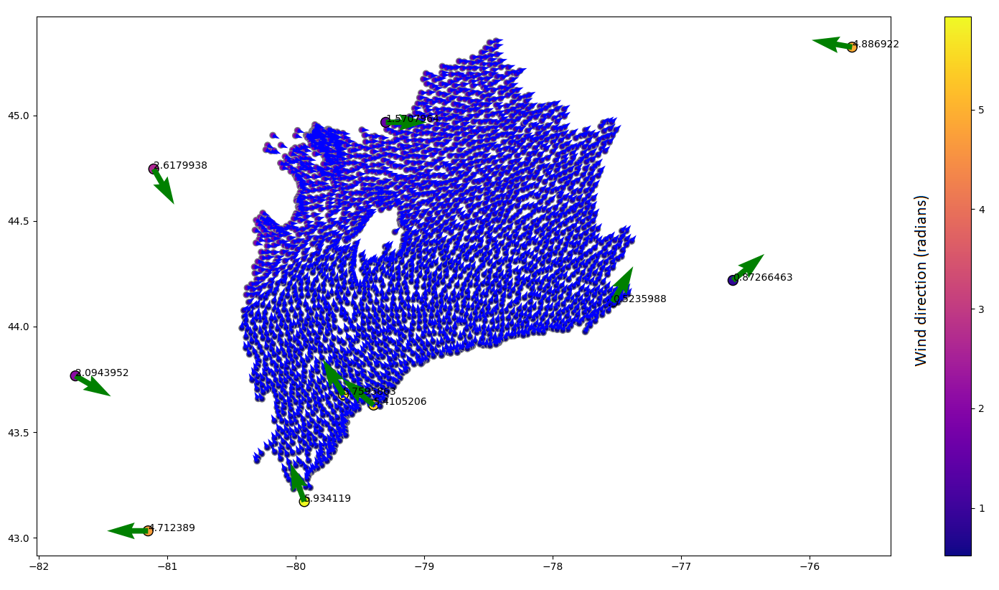
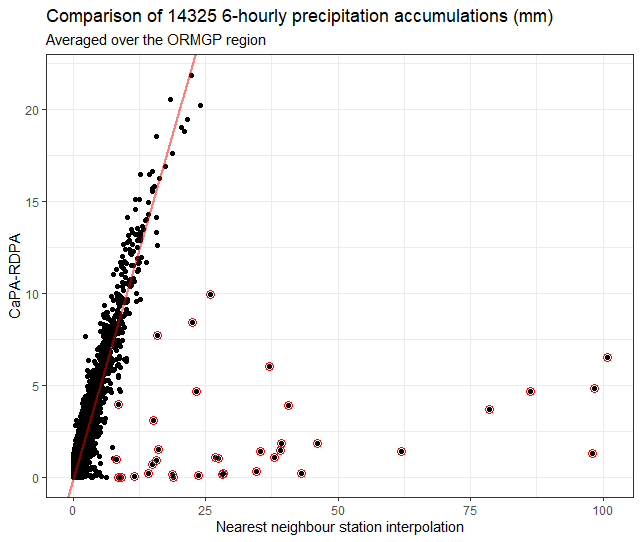

* TOC
{:toc}

# Interpolation of Hourly scalars to Sub-daily Basins
Below is an itemized description of the interpolation process, with open data access.  All interpolated (i.e., "vector") data are automatically updated and maintained using the [ORMGP-FEWS system](/interpolants/fews/) system.

> workflow: `preprocessMSCtoBasinsHourly.xml`

## Meteorological Service of Canada (MSC) scalars
1. Scrape MSC for recent data, executed from FEWS.
2. Import scraped MSC hourly scalars into FEWS.
3. Export hourly MSC NetCDF file (*.nc) from FEWS, from 1989-10-01 
    
    > `_exportMSChourlyNetcdf.nc`  $T_a, p_a, r, \text{vis}, u, u_\alpha$

4. Interpolate to 10 km sub-watersheds, using a python script executed from config file `pyMSChourliesToBasin.xml` that executes: `ncMSCtoHourlyBasinNetCDF.py`.
    - Air temperature $(T_a)$, relative humidity $(r)$ and wind speeds $(u)$ are interpolated using a [radial basis function (RBF)](https://docs.scipy.org/doc/scipy/reference/generated/scipy.interpolate.Rbf.html) (with a cubic kernel and a smoothing factor $\lambda=1/1000$ to prevent singular matrices).
    - Air/barometric pressure $(p_a)$ are first [corrected for elevation](/interpolants/interpolation/barometry.html) then interpolated using the same cubic RBF. 
    - Wind directions $(u_\alpha)$ are split into their x-y components, each interpolated separately using a cubic RBF before returned to an angle. A sample result is shown below:

5. Interpolated $(T_a, r, u)$ are applied to compute potential evaporation flux [m/s] (Novák, 2012):

$$
    E_a=7.46\times 10^{-9} \cdot (a + ub) d_a
$$

$$
    d_a=(1-r) \cdot e_s(T_a)
$$

6. Save to NetCDF (.nc) for import back to FEWS.

    > `_exportMSChourlyNetcdf_interp.nc`  $T_a, p_a, r, u, E_a$ hourly basins

## Hourly Basin to 6-hourly Basin Interpolation

1. Hourly aggregation to 6-hourly time intervals (00:00 06:00 12:00 18:00 UTC) is performed in FEWS using the:
    - [MeanToMean aggregation](https://publicwiki.deltares.nl/display/FEWSDOC/Aggregation+MeanToMean) routine for $Ta, p_a, r, u$, and
    - [Accumulative aggregation](https://publicwiki.deltares.nl/display/FEWSDOC/Aggregation+Accumulative) routine for $E_a$.

    *__These data have a set expiry.__*

2. Export 6-hourly, basin-interpolated $P_\text{HRDPA}, T_a, p_a, r, u$ to NetCDF. 

    > `yyyyMMddHHmm-6hourlyBasin.nc`

    *__to be altered to__* $P_\text{HRDPA}, P_R, P_S, T_a, p_a, r, u, E_a$

# 6-hourly Precipitation to Basins

The 6-hourly CaPA-RDPA precipitation $(P)$ field is a gridded raster that is routinely scraped of open web resources and proportioned to the sub-watersheds using our ORMGP-FEWS system, using the [Interpolation: SpatialAverage](https://publicwiki.deltares.nl/display/FEWSDOC/InterpolationSpatialAverage) transformation.

# Rainfall-Snowfall Parsing
The [CaPA-RDPA](/interpolants/sources/climate-data-service.html#eccc-regional-deterministic-precipitation-analysis-rdpa) data are collected in their 6-hourly steps are used on their own and are aggregated to daily __*precipitation*__ accumulations. The precipitation fields are proportioned into rainfall and snowfall amounts using an "optimized critical temperature" approach where precipitation fields are proportioned into rainfall and snowfall amounts. Optimization determines a critical temperature $ (T_\text{crit}) $ for every ["water year"](## "defined as a year from October 1 to September 30"), where:

$$
\text{Rainfall}=
\begin{cases}
\text{Precipitation}, & \overline{T}>T_\text{crit}\\
0 & \text{otherwise},
\end{cases}
$$

$$
\text{Snowfall}=
\begin{cases}
\text{Precipitation}, & \overline{T}\leq T_\text{crit}\\
0 & \text{otherwise}.
\end{cases}
$$

An optimization routine is employed to determine $ T_\text{crit} $ such that total snowfall converges with total snowmelt *independently for every winter season* to ensure minimal deviation from total precipitation. 

# Spatial Interpolation versus DAS

A common question on the *data assimilation systems* (DAS) data employed by the ORMGP is how they compare to interpolated point data. In particular, we have met resistance to the use of [CaPA-RDPA](/interpolants/sources/climate-data-service.html#eccc-regional-deterministic-precipitation-analysis-rdpa) data as it has been known to disagree at times with point observations. But this is an unfair comparison as one should really expect every pixel of the CaPA field to be derived with some uncertainty.

These distributed products at the ORMGP provide an idea of precipitation as it covers our entire 30,000 km² jurisdiction. Comparisons of point stations to these fields fail to take in account the issue of how one should *interpolate* the point stations over space, as is always required prior to hydrologic modelling, for instance.

So, in addition to comparing point stations (which themselves as known to be ±5% in error--Legates and DeLiberty, 1993--and [many don't record trace amounts](https://www.canada.ca/en/environment-climate-change/services/weather-general-tools-resources/frequently-asked-questions.html) less than 0.2 mm per hour), one should also be comparing how a field interpolated for point stations compare with CaPA-RDPA.

Below shows a figure comparing CaPA vs. interpolated station data over the past 10 years of 6-hourly accumulations at time when precipitation was observed by either dataset. Station data are interpolated using the nearest neighbour approach. Both fields are then averaged over the 30,000 km² ORMGP jurisdiction.

It's clear that for the most part, the 2 approaches are in agreement to within ±2 mm per day; 1:1 line shown in red. Major discrepancies (circled red) occur when heavy rainfall events are measured at individual stations and the interpolation scheme over exaggerates the extent of the intense storm, which in southern Ontario tends to be convective (i.e., small extent) in nature. This is the problem we are trying to overcome as it appears that inadequate estimates of spatial distributions can be a greater source of error than the accuracy of any particular CaPA-RDPA pixel.

# References

Legates, D.R., DeLiberty, T.L. 1993. Precipitation measurement biases in the United States. – JAWRA Journal of the American Water Resources Association, 29(5), 855–861.

Novák, V., 2012. Evapotranspiration in the Soil-Plant-Atmosphere System. Springer Science+Business Media Dordrecht. 253pp.

