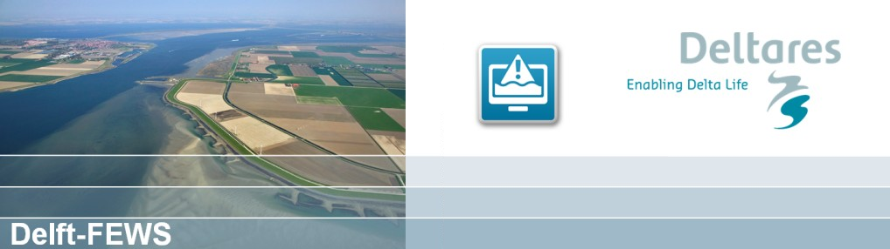

# Delft-FEWS (**F**lood **E**arly **W**arning **S**ystem)

[Delft-FEWS](https://www.deltares.nl/en/software-and-data/products/delft-fews-platform) is an industry-standard *"platform for real time forecasting and water resources management"* (Delft-FEWS brochure, 2015). Its strength is that it, as a stand-alone product, can i) fetch forecast data from third-party APIs, ii) interpolate data to/from points, grids and shapes, iii) aggregate and re-generate data from their source to any time scale, all with the ability to operate using a GIS-like platform. FEWS is a fully-generalized water data management tool. [*See also the DELFT-FEWS about page for more information.*](https://oss.deltares.nl/web/delft-fews/about-delft-fews)

In addition, FEWS has the ability to run scripts from command line, which, among other purposes, means that FEWS can even integrate with, say, any hydrological model by creating input data, running the model (via command), importing the resulting model output and providing alerts should any threshold be met.

# ORMGP-FEWS

> The ORMGP-FEWS system operates using version 2019.02.

The "ORMGP-FEWS" system is used to organize data collected from a variety of sources (international, federal, provincial and municipal agencies, academia and private organizations) and consolidates these data to a single spatially-distributed, temporally-aggregated data product that we offer to our partners and utilize internally.

### End Product
The ORMGP maintains two long-term climatological datasets that are updated nightly: one at a daily timescale since 1901, and the second at a 6-hourly dataset since 2002. The data, [infilled and distributed](/interpolants/fews/climate-interpolation.html) at a 10 km² spatial resolution across our jurisdiction, include:

1. Rainfall
2. Snowfall, snowmelt and snow equivalent (SWE)
3. Air temperature and pressure
4. Relative humidity
5. Wind speed and direction
6. Potential evaporation

The data support a wide variety of web services offered by the ORMGP where knowledge of past climactic conditions have a direct causal link to other monitored phenomena.  [*All data sources can be found here.*](/interpolants/sources/reference.html)

## Data types
The types of time-series data hosted in FEWS are described as:

1. **Scalar data** — These are data most common to environmental databases. They are data collected at stations and represent phenomena measured at a point.  These data require spatial interpolation to convert them to a distributed field.
1. **Vector data** — These data come in a distributed (i.e., raster) form, and thus may not require further interpolation.  This data format is relatively new given reduced technological constraints and have yet to make significant gains in practice. More and more open international sources offer such data, free of charge. Difficulties with the data are its management, as they do not lend themselves well to standard "normalized" database schemas.  FEWS, on the other hand, is especially tailored to handle and manipulate vector data.

 

*Example "vector" data: 6-hourly ORMGP-interpolated precipitation (CaPA-RDPA) animated in FEWS*

 

# References

https://www.deltares.nl/app/uploads/2015/01/Delft-FEWS_brochure-2017.pdf
