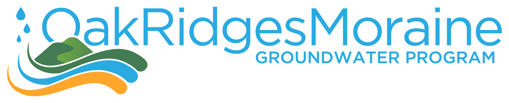
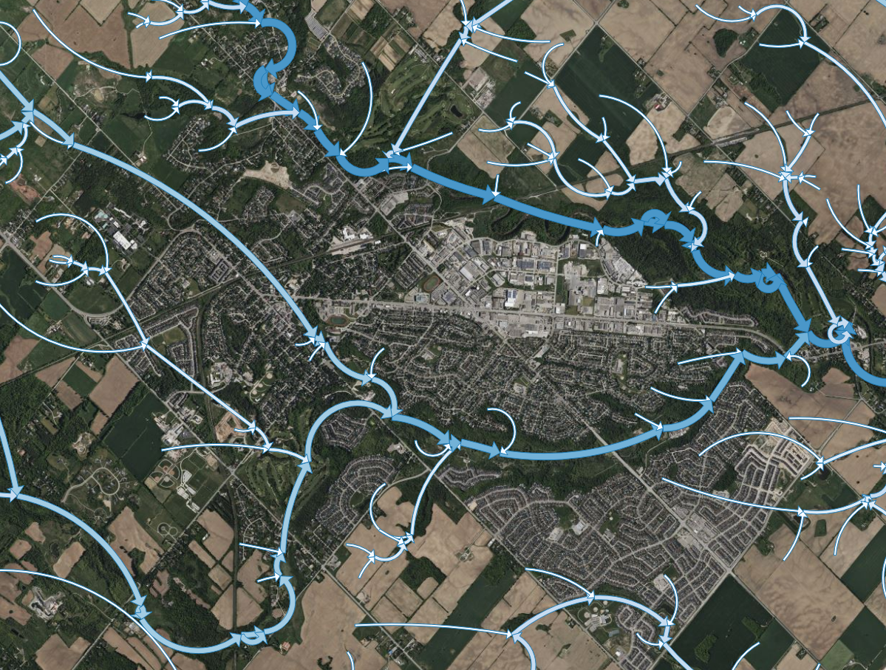

 

The [**Oak Ridges Moraine Groundwater Program (ORMGP)**](https://www.oakridgeswater.ca/) maintains an authoritative understanding of: 

1. the geological layering for the area; 
1. the groundwater flow system; and
1. linkages to the region's surface waters and climatologies. 

**The ORMGP has the need to:**
- coordinate disparate datasets so that correlation among environmental phenomena can be investigated
- data are sourced primarily from open datasets and are ingested into our database
- by virtue of being in our database, web applications allowing users to analyze the data become available
- this is a system of delivering information needed for water resources and planning.

The following is an index to the data maintained and produced by the ORMGP. All data can be cited using the link below.

Contents

* TOC
{:toc}

 

# **Data Warehousing** *--how we store our data*

## **The ORMGP Database (MSSQL)**
[Our main MSSQL Server database](/database-manual/Contents/TOC.html) holds all the information to support our decision-making tools. The ORMGP data systems are *active*, in that they are automatically updated at near real-time. From hourly and daily intervals, a series of web-scraping routines have been written to access open data made available from many sources including international, federal, provincial, municipal and conservation authority agencies. The objective is to centralize hydrogeological and hydrological data for the south-central Ontario (Canada) jurisdiction that currently makes-up the ORMGP. 

[**_Data source references._**](/interpolants/sources/reference.html)

## Delft-FEWS

The [Delft-FEWS](https://www.deltares.nl/en/software-and-data/products/delft-fews-platform) platform offers a streamlined user interface that allows practitioners to visualize time-varying spatially-distributed data from a variety of sources and formats. For instance, spatial/vector/raster time-series datasets common to climatology differ from the point/location datasets contained in the SQL database. We maintain a Delft-FEWS platform to manage these data formats. Our [**ORMGP-FEWS**](/interpolants/fews) system periodically ($\leq$ 1 day) scrapes data from federal, provincial, municipal and partner agencies to support a variety of APIs serving near-real-time historical climatologies to our partner users.

More information:
1. About the [Delft-FEWS](https://oss.deltares.nl/web/delft-fews/about-delft-fews) product by Deltares.
1. More information on ORMGP [*web data scraping*](/interpolants/sources/webscraping.html) and the [sources scraped on a nightly basis](/interpolants/sources/index.html).

 

# **Data Sources** *--where we get our data*

## Geology

[Description of the geological layers, their interpreted depositional setting, and of the procedures used to interpolate the surfaces.](/GeoLayers/)

* [Geology](/info/md/geology.html)
* [Drilling](/info/md/drilling.html)
* [Bedrock Geology](/info/md/bedrock.html)
* [Sedimentology](/info/md/sedimentology.html)
* [Geologic Pick database](/snapshots/md/picks.html)

## Hydrogeology
* [**ORMGP monitoring sites**](/monitoring/)
* spotflow/baseflow surveys
* Database groundwater monitoring locations:

<iframe src="https://golang.oakridgeswater.ca/pages/ycdb-locations.html" width="100%" height="400" scrolling="no" allowfullscreen></iframe>
_Monitoring locations with >35 monitoring dates_

 

## Elevation, Drainage and Topology

### Digital elevation

For groundwater elevations, [digital elevation data are used to correct depths](/database-manual/02_Understanding_ORMGP_Database/02_03_Primary_Data_Relationships/02_03_05_Water_Level.html) of measure to metres above sea level (masl). Therefore, vertical accuracy and datum are tied to the digital elevation (terrain) model (DEM) we used as reference. Currently, correction are taken to the 10m [2006 OMNR *Digital Elevation Model - Version 2.0.0 - Provincial Tiled Dataset*](https://raw.githubusercontent.com/OWRC/metadata/main/external/mnr2006dem/LIO%20MNR%20DEM%2010m%20Metadata.pdf).

### Overland flow

Overland flow drainage and their pathways (topology) are defined using the 30m [Provincial Digital Elevation Model - South (CGVD2013)](/metadata/external/pdem) followed by a [hydrological "correction"](/interpolants/interpolation/overland.html) to ensure continuous flow paths--needed for drainage area delineation for example.

An additional derivative of the corrected DEM is the discretization of the ORMGP jurisdiction into a number of [sub-watersheds](/interpolants/interpolation/subwatershed.html):

<iframe src="https://golang.oakridgeswater.ca/pages/sws-characterization.html" width="100%" height="400" scrolling="no" allowfullscreen></iframe>
_Sub-watershed characterization and flow topology_

 

### Watercourse topology and stream order

Watercourse mapping was retrieved from the [Ontario Hydro Network (OHN) - Watercourse](https://geohub.lio.gov.on.ca/datasets/a222f2996e7c454f9e8d028aa05995d3_26/about) layer that provides the location of watercourses in Ontario and is offered by the Ontario Ministry of Natural Resources and Forestry. From this, a [spatial algorithm](/interpolants/interpolation/watercourses.html) is performed in order to assign every stream segment the upstream and downstream segment(s) connected to it. This allows for tracking of flow-paths along stream channels, determining flow directions, stream order, etc.

 

## Hydro-meteorological station data  
* [Data source **References**:](/interpolants/sources/index.html#climate-data-and-streamflow) climate and streamflow
* [Baseflow/Hydrograph Separation](/info/hydrographseparation/)
* [**Spatial Interpolation**](/interpolants/fews/climate-interpolation.html) of point data
* [**Near-Real-Time Data Acquisition**](/interpolants/sources/climate-data-service.html), updated nightly, including:
   * Daily data
      * Min/max daily temperature
      * Atmospheric/Barometric pressure
      * Precipitation (rainfall and snowfall)
      * Snowmelt ([sourced and computed](/interpolants/modelling/waterbudget/data.html#sub-daily-from-daily-snowmelt))
      * Potential evaporation ([computed](/interpolants/interpolation/calc/panET/PanEvaporation.html))
      * Streamflow
      <!-- * Solar irradiation -->
   * Hourly data, updated every 6-hours, including:
      * Precipitation (distributed, re-analysed, 6hr accumulations)
      * Air temperature
      * Atmospheric/Barometric pressure
      * Relative humidity
      * Windspeed and direction
      * Potential evaporation flux

[*see interpolated data below*](#spatially-interpolated-near-real-time-data)

 

# **Web Applications** *--how we disseminate our data*

## **Geocortex** [Data Portal](https://maps.oakridgeswater.ca/Html5Viewer/index.html?viewer=ORMGPP)

The ORMGP Geocortex Mapping hub has been divided into various [_**Theme Maps**_](/webmapping/) to allow users to quickly hone in on the information they might be seeking. For example, the Documents Theme Map provides access to the program’s library of reports, The Boreholes Theme Map focuses on providing access to borehole specific information, and the Geology Theme Map provides access to all of the ORMGP geologically related mapping. The Theme Maps group specific related data sets or interpreted products ([more info here](/webmapping/)).

*Our current [web-mapping system](https://maps.oakridgeswater.ca/Html5Viewer/index.html?viewer=ORMGPP) relies on Geocortex*

### Geological layer theme

The [geological layers made available on the Geocortex portal](/interpolants/interpolation/geolayers.html) are found in two places: the Geology Theme Map and the [cross-section tool](#cross-section-tool). More information on [their interpreted depositional setting and of the procedures used to interpolate the surfaces](/GeoLayers/).

In the [Geology Theme Map](/webmapping/#geology-map), users can view either the tops of or the isopach/thickness of any of the layers.  The Geological Picks made at each well, that are used to construct or interpolate each layer are also available.  A screen capture from the website showing the Top of Halton Till as well as the picks is shown below.

*Screenshot of our Geocortex [web-mapping system](https://maps.oakridgeswater.ca/Html5Viewer/index.html?viewer=ORMGPP) showing geologic layers*

 

## **Cross-section tool**

The cross-section tool is designed to provide a cut, along a user-defined line, through the subsurface to display the regionally interpreted Quaternary [geological layers](/GeoLayers/) down to the bedrock. 

*Screenshot of our cross-section tool*

 

Included in the Cross-section tool (in addition to hydrostratigraphy):

- local boreholes from the ORMGP database
- [Watertable](#water-table-mapping)
- Top surface DEM ([*see metadata*](/metadata/external/mnr2006dem/LIO%20MNR%20DEM%2010m%20Metadata.pdf))

 

## Piper plots

The piper plot tool presents water chemistry in an informative way and can be sorted by location or geologic formation. Out piper plot tool take chemistry data in our database and creates the plots *on-the-fly*, for one or many locations.

*Screenshot of our database-generated piper plot*

 

## Spotflow Pickup

Spotflow surveys added to the ORMGP database are automatically hosted on our baseflow pickup API that translates spotflow measurements into a losing/gaining stream reach feature map. This is done by (algorithmically) coordinating surveyed spotflow locations to our [watercourse topology](/interpolation/watercourses.html) layer. For example, any 2 spotflow measurements connected by any number of stream reaches will convert the baseflow discharges measured into a linear computation rates of gain/loss per unit kilometre of stream reach.

*Screenshot of our [(beta) spotflow pickup tool](https://owrc.shinyapps.io/pickup/). Blue features represent baseflow gains, while red are losses computed between spotflow measurements (circles). Hovering over reaches/point will reveal their values.*

 

*Summary of spotflow measurements shared amongst our partners.*

 

## **Clip 'n Ship**
* ["Clip 'n Ship"](/interpolants/sources/clipnship.html) — A bulk spatial data export system, by geographic extent provided by a user and returned many of the products listed below clipped to within the specified extent.

 \
*Source: [ArcMAP Clip function](https://desktop.arcgis.com/en/arcmap/latest/tools/analysis-toolbox/clip.htm).*

 

## Shiny Hydrology  *(sHydrology)*
R-Shiny-Leaflet mapping with access to our monitoring dataset. [**Go to online map.**](https://owrc.shinyapps.io/shydrologymap/)

 

### Time-Series Analysis
* **R-Shiny apps**
   * [Help](/HydrographExplorerHelp/)
   * [Manual](/shinyapps-manual/)
* [Automatic hydrograph separation](/info/hydrographseparation/)
* [Hydrograph disaggregation](/info/hydrographdisaggregation/)

<!-- *and many more (TODO)* -->

<!-- ADD SNAPSHOTS HERE -->
<!-- shikaze: should we keep snapshots on a separate github to keep things simpler? -->

 

# **Open Data Products** *--the data we create*

Below lists the data products and surfaces produced and offered by the ORMGP, many of which can be accessed via [our clip 'n ship tool](#clip-n-ship).

## Metadata

[*Our metadata repository, Table of Contents.*](/metadata/content/toc.html)

Surfaces

- [Hydrologically Conditioned DEM](/metadata/surfaces/hdem.html)
- [Land Use _(full coverage)_](/metadata/surfaces/land_use.html)
- [Potential Discharge Areas](/metadata/surfaces/potential_discharge.html)
- [Potentiometric Surface](/metadata/surfaces/potentiometric_surface.html)
- [Surficial Geology _(full coverage)_](/metadata/surfaces/surficial_geology.html)
- [Topologically Conditioned Sub-watersheds](/metadata/surfaces/topo_sws.html)
- [Topologically Conditioned Watercourses](/metadata/surfaces/topo_watercourse.html)
- [Water Table](/metadata/surfaces/water_table.html)

 

## Geospatial Layers
<iframe src="https://golang.oakridgeswater.ca/pages/ormgp-image-server.html" width="100%" height="400" scrolling="no" allowfullscreen></iframe>
_Static 2D fields as hosted on the ORMGP image server, updated frequently_

### Bedrock
### **Geological Surfaces (2021)**

The geology layers presented on the ORMGP Website have been created at different times, and in cases, by different parties over the years.  ORMGP staff are regularly checking the geological layers, making adjustments over time. However, these incremental changes are only periodically updated onto the website. The Figure below shows the various sets of geological layers that have been built into a regional picture and that are currently reflected on the ORMGP website.

[*more info*](/interpolants/interpolation/geolayers.html)

### **Water Table Mapping**

The Oak Ridges Moraine Groundwater Program (ORMGP) has been working on producing a reliable water table map for quite some time. Over the years several versions of the water table surface have been prepared as new information has become available or as the technical mapping methodology has been adjusted. Although it sounds straightforward to interpolate a water table surface, there are a number of factors that make the process difficult. Here we outline some of the considerations that have gone into creating the water table surfaces (and their derivatives) and can serve as a supplementary document for those that make use of these layers. For more information, see the [*Fact Sheet*](/watertable/).

### Land use

The source of the land use data is: *Ministry of Natural Resources and Forestry, 2019. Southern Ontario Land Resource Information System (SOLRIS) Version 3.0: Data Specifications. Science and Research Branch, April 2019.*

From this layer, the follow land use categorizations are derived:

- impervious cover
- canopy cover
- wetland cover
- open water
- relative permeability

[*more info*](/interpolants/interpolation/landuse.html)

### Surficial Geology

The source of the land use data is: *Ontario Geological Survey 2010. Surficial geology of southern Ontario; Ontario Geological Survey, Miscellaneous Release— Data 128 – Revised*. From this layer, approximations of percolation rates that affect recharge rates.

[*more info*](/interpolants/interpolation/surfgeo.html)

 

## Spatially interpolated, near real-time data

* [**Near Real-time Climate Data Service**](/interpolants/sources/climate-data-service.html) for use in our water budget product which includes the computation of [potential evaporation](/interpolants/interpolation/calc/panET/PanEvaporation.html), [snowmelt](/interpolants/modelling/waterbudget/data.html#sub-daily-from-daily-snowmelt), etc. from available data.
* [Spatial and Temporal interpolation](/interpolants/fews/climate-interpolation.html) of point/scalar data.
* [Barometric pressure](/interpolants/interpolation/barometry.html) elevation-corrected and projected to a 2km regional grid.

 

<iframe src="https://golang.oakridgeswater.ca/pages/swsmet.html" width="100%" height="400" scrolling="no" allowfullscreen></iframe>
_Distributed time-series data, updated nightly_

 

# **Numerical Modelling** *--how we help make informed decisions*

Numerical modelling at the ORMGP proceed in a number of ways: 

1. A long-term data assimilation system that uses hydrological analysis tools (i.e., models) and leverages the ORMGP's database. What amounts to a [*data assimilation system*](https://ldas.gsfc.nasa.gov/) (DAS), modelling technology is utilized to provide a real-time state of the hydrological system with the ORMGP jurisdiction, supported by the [data we manage](/interpolants/#data-sources). The computational structure of the DAS is specifically tailored to run as fast as possible, such that thousands of model "projections" made continuously on [ORMGP servers](/interpolants/#ormgp-servers). The results from these analyses are offered as monthly ranges in long term seasonal water balance estimates.
1. The ORMGP has been charge with maintaining over [100 existing numerical models](/interpolants/#numerical-model-custodianship-program) of varying types and purposes. We actively strive to ensure that these models are mainlined in an operational state, such that they can be readily shared with future modellers, thereby reducing the need for reproducing past work and maintaining past knowledge.
1. Outputs from select models maintained in our Numerical Model Custodianship Program are further processed to give our partners an interactive utility to the model's estimation of our regional flow system. For instance, users can readily visualize virtual [particle tracking](/interpolants/#particle-tracking-web-tool) to and from any location clicked within the model domain.
1. Other tools are intended for predictive use, but are restricted to short-term (say, less than 30 days) projections. The design of these models is more physically rigorous but will always be dependent on other models (e.g., existing groundwater models, the ORMGP DAS) to prescribe the antecedent conditions. While computational time for this model is orders of magnitudes greater than that of the DAS, it continuous to share the philosophy of designed whereby computation efficiency is paramount.

Combined, these two tools will provide all water groundwater resources needs for the ORMGP partners in order to:

1. utilize readily available datasets provided daily by government agencies of Canada and the United States without the need for [data pre-processing](/interpolants/modelling/waterbudget/data.html);
2. capture long-term hydrological water budget estimates with an emphasis on its certainty; and,
3. project near-term hydrological response given a known antecedent state.

## Numerical Model Custodianship Program

> Existing numerical model files, output and sharing

We have established a numerical modelling sharing process to assist consultants in moving forward on various projects by making use of previous interpretations/work.  The mission of the [**ORMGP numerical model custodianship program**](/snapshots/md/numerical-model-custodianship-program.html) is to provide numerical models to any consultant undertaking work within our partners' jurisdiction.  

Users (e.g., consultants) are expected to review the shared models' suitability to their intended application. Considering the age of the models, the expertise who constructed the model, the model's original intent, etc., it is the responsibility of the user to determine whether there is an approach more suitable than just using the model files as delivered. For instance, some consultants have only selected specific model file components (i.e., hydraulic conductivity distribution or geological layering, thicknesses etc.) to complete their task.

Users are free to update/modify the model in the hopes that the refinements are shared with the ORMGP in return for the sake of preserving knowledge.

Often, within any geographical area of a new/proposed consulting project, there are several models that could be used to aid the new project. Given the nature of the proposed project (e.g., water supply, contamination investigation, proposed land development, etc.) we may suggest the most appropriate model or the consultant is free to select any or all models, where available.  

The idea is that model sharing could perhaps reduce duplication of effort, thereby lowering consulting costs by providing previous modelling insights in a transferable digital format.  Given that every project is different, the likelihood that a model can be transferred to address the needs of a another study may be quite low.

  
* [Numerical Model Custodianship Program](/snapshots/md/numerical-model-custodianship-program.html) — model archive.
* [*A Guide for Actively Managing Watershed-Scale Numerical Models in Ontario*](https://www.oakridgeswater.ca/_files/ugd/4a0a6e_c41c71a481ea4657806e1fbb0c912f7a.pdf) — model management guidance (2017)

<iframe src="https://golang.oakridgeswater.ca/pages/numerical-model-custodianship-program.html" width="100%" height="400" scrolling="no" allowfullscreen></iframe>

_Set of numerical models maintained in the custodianship program_

 

## **Particle Tracking** web-tool

The ORMGP particle tracking tool shows both the forward or backward particle tracking from a site that is being studied.  The tool is built upon [numerical models](/snapshots/md/numerical-model-custodianship-program.html) which have organized, synthesized and interpreted a wealth of hydrogeological information (e.g., boreholes, geological mapping, previous studies, etc.). 

* More info on 3D [**particle tracking** of the groundwater flow system and the methodology used in our web tool](/interpolants/modelling/particleTracking/).

*3D example of particles tracking within a 5-layer groundwater flow model--click on image to play with the interactive version*

 

## Regional **Water Budget**, Long-term and Continuous
* Fine-resolution (3,600 m²) [**Water Budgeting** using a  regionally-distributed runoff-recharge model](/interpolants/modelling/waterbudgetmodel.html) for Long-term (>20 years) continuos 6-hourly hydrological modelling of the ORMGP jurisdiction.
* Data sources for the water budget model are discussed [here](/interpolants/modelling/waterbudget/data.html).

<iframe src="https://golang.oakridgeswater.ca/pages/Raven23WB-compare.html" width="100%" height="400" scrolling="no" allowfullscreen></iframe>

_Comparison of integrated vs. contemporary recharge modelling._

 

## ORMGP Raven Model

In addition to the Water Budget model, the ORMGP hosts a semi-distributed rainfall runoff model built using the [**Raven hydrological modelling framework**](https://raven.uwaterloo.ca/). The model was initially developed to support the Water Budget (recharge) model in that it is built on the same [sub-watershed network](/interpolants/interpolation/subwatershed.html), [land-use](/interpolants/interpolation/landuse.html), [surficial geology](/interpolants/interpolation/surfgeo.html), [climate forcings](/interpolants/sources/climate-data-service.html), etc. With this *traditional* hydrologic model, results are indeed similar--although at the moment more calibration is required. We are happy to share the model (in full or in part) to anyone interested. [*More details here*](/interpolants/modelling/ravenmodel.html).

## Short-term/event-based hydrology
* [Lateral water movement:](/info/lia/) a local inertial approximation of the shallow water equation for lateral movement of water.
* [Multiphase flow through porous media:](/info/pmflow/) a one-dimensional fully-implicit multi-layer solution to multi-phase flow through porous media used to investigate infiltration, evaporation and runoff generation.

## Other
* [Geothermal transport modelling.](/info/geothermal/)
* Urban water balance, Low Impact Design (LID) modelling, groundwater *I&I*, etc. using [_**GSFLOWurban**_](https://github.com/maseology/GSFLOWurban).
* [Artificial Neural Network Machine Learning hydrograph simulation.](/info/ann/)

<!-- * [Input data](/interpolants/modelling/waterbudget/data.html) -->
<!-- * [Soil moisture accounting](/interpolants/modelling/waterbudget/sma.html) -->
<!-- * [Total evaporation](/interpolants/modelling/waterbudget/pet.html) -->
<!-- * Potential Solar Irradiation -->
   <!-- * [Atmospheric transmittance](/interpolants/modelling/BristowCampbell.html) -->
<!-- * [Snowmelt](/interpolants/modelling/waterbudget/snowmeltCCF.html) -->
<!-- * [Shallow groundwater](/interpolants/modelling/waterbudget/gw.html) -->
<!-- * [Overland flow routing](/interpolants/modelling/waterbudget/overlandflow.html) -->
<!-- * [References](/interpolants/modelling/waterbudgetmodel.html#references) -->
   

 

# **Technologies** *--the tools we use*

A number of open-source and proprietary data analysis tools have been employed in our overall data management system. In contribution to the open-source community, much of our work has also left open [on our Github](https://github.com/OWRC).

## Tools (external links)
* [Github pages](https://pages.github.com/) — the hosting of technical information, like what you see now.
* [Python](https://www.python.org/)
   * [Beautiful Soup](https://www.crummy.com/software/BeautifulSoup/bs4/doc/) — web scraping
   * [NumPy](https://numpy.org/), [Pandas](https://pandas.pydata.org/) — data manipulation
   * (and many more)
* [Go](https://go.dev/)
* FORTRAN/C++
* VB.NET/C#
* [R](https://www.r-project.org/) and [RStudio](https://www.rstudio.com/) — a free, open-source "...software environment for statistical computing and graphics."
   * [R-Shiny](https://shiny.rstudio.com/) — online, real-time data analytics
   * [Leaflet for R](https://rstudio.github.io/leaflet/) — web mapping
   * [ggplot2](https://ggplot2.tidyverse.org/) — data visualization
   * [dygraphs for R](https://rstudio.github.io/dygraphs/) — dynamic time-series visualization
* [Surfer](https://www.goldensoftware.com/products/surfer/) for geo-statistical analysis such as surface kriging. 
## Databases (external links)
* [MSSQL](https://www.microsoft.com/en-us/sql-server/sql-server-2019)
* [Delft-FEWS](https://www.deltares.nl/en/software-and-data/products/delft-fews-platform)

 

## **ORMGP Servers**

### Databases and REST-APIs
* **[Our main MSSQL Server database](/database-manual/Contents/TOC.html)**
* [VertiGIS Studio/Geocortex](https://www.vertigis.com/vertigis-studio/) — Our principle [web mapping server](https://maps.oakridgeswater.ca/Html5Viewer/index.html?viewer=ORMGPP) used by partners to access our database and products.
* golang server — multi-functional REST API serving a variety of data products and interpolation tools.
* fews server — home for the [ORMGP-FEWS](/interpolants/fews/) data management system.
* image server — hosts many of the data layers produced by the ORMGP (and discussed above).
* data server — REST-API hosting GET-only requests to the ORMGP central database.

### Web Scraping
* ORMGP-cron: a linux server with scheduled [web-scraping tasks mostly written in Python](/interpolants/sources/webscraping.html).
* [ORMGP-FEWS](/interpolants/fews/): our operational Delft-FEWS system that scrapes, stores, interpolates and regenerates data served on ORMGP-cron.

# **Glossary**
[*click here*](glossary.html)

