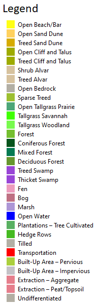

The Ontario Ministry of Natural Resources and Forestry (2019) SOLRIS version 3.0 provincial land use layer is employed to aggregate imperviousness and canopy coverage at the sub-watershed scale. In areas to the north, where the SOLRIS coverage discontinues, interpretation was supplied by the [Agriculture and Agri-food Canada Annual Crop Inventory](https://open.canada.ca/data/en/dataset/ba2645d5-4458-414d-b196-6303ac06c1c9) (2013). (for more details, please refer to the layer's [metadata](/metadata/surfaces/land_use.html).)

<iframe src="https://golang.oakridgeswater.ca/pages/landuse23.html" width="100%" height="400" scrolling="no" allowfullscreen></iframe>
_ORMGP land use as hosted on our image server_

This land use layer is used primarily to assign hydrologic properties to the ORMGP [water budget model](/interpolants/modelling/waterbudgetmodel.html#land-use-and-surficial-geology).

# Raster download

The version 2023 ORMGP land use surface can be found [here](https://www.dropbox.com/scl/fi/428o1h1a3qg1xnnt7g1iz/landuse23.tif?rlkey=9kzwrrvpi6mb9plwzajy8wiof&dl=1). See also the [metadata](/metadata/surfaces/land_use.html).

## References

Agriculture and Agri-food Canada, 2013. Data Product Specifications (ISO 19131) rev. A. 31pp.

Ontario Ministry of Natural Resources and Forestry, 2019. Southern Ontario Land Resource Information System (SOLRIS) Version 3.0: Data Specifications. Science and Research Branch, April 2019.

