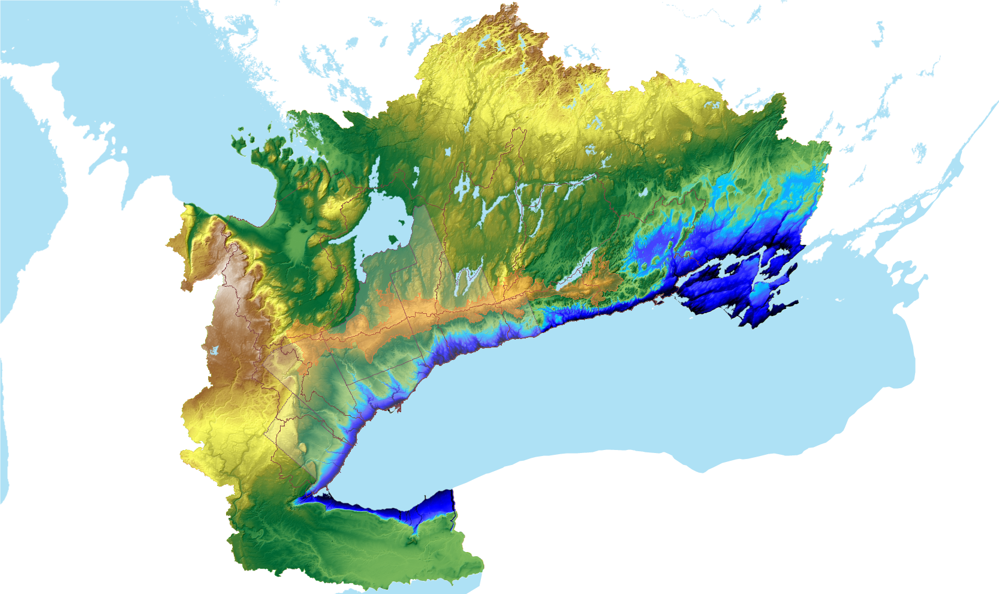
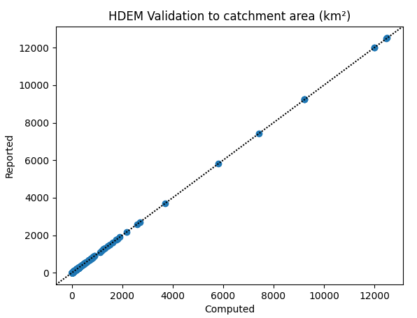

# Summary

* A so-called "hydrologic correction" has been applied to a regional digital elevation model (DEM) of our study area
* Hydrologic correction has enabled for the ability to automatically delineate contributing areas to *any* point in our jurisdiction.


# Digital Elevation Model
Ground surface elevations were collected from the Ontario Ministry of Natural Resources and Forestry [Provincial Digital Elevation Model (PDEM)](https://geohub.lio.gov.on.ca/maps/mnrf::provincial-digital-elevation-model-pdem/about) at the CGVD2013 vertical datum,  last updated 26 September 2023. This is a 30x30m² DEM. Surface *metadata* can be found [here](https://www.arcgis.com/sharing/rest/content/items/882a9059ec7c4881abbdb6afa0ae73e6/info/metadata/metadata.xml?format=default&output=html).


Elevation data were down-scaled by taking the average of known elevations occurring within every 60x60m² cell. The resulting grid is a 4836x5450 60m-uniform cell grid, with an upper-left-corner origin at E: 1,273,200; N: 12,107,220, NAD83--Ontario MNR Lambert (EPSG:3161).


# Hydrological "correction"

An automated topological topological analysis is performed on the DEM using the following methodologies:

<!-- 1. Cell slopes and aspects are computed using a 9-point planar regression from the cell's elevation plus its 8 neighbouring grid elevations. -->
1. DEM cell slopes and aspects are computed using the Tarboton (1997) method that breaks the gridded elevation surface into eight planar triangular facets at every cell. The steepest downward facet from the a cell is use to determine slope and aspect.
2. Automated depression filling (Wang and Liu, 2006) was applied to the DEM. This filtering of elevation data ensures that every grid cell has at least 1 neighbouring cell with an assigned elevation at or below the current cell's elevation. This ensures that "drainage" is never impeded.
3. While the above code works for most of the area, it will leave flat (zero-gradient) regions especially around lakes and wetlands. A fix by Garbrecht and Martz (1997) was added to ensure a consistent flow direction with negligible change to the corrected DEM.
4. Flow paths are then computed based on the "D8" algorithm (O'Callaghan and Mark, 1984).

The final product is here termed the *Hydrologically corrected Digital Elevation Model* (HDEM).

## Manual adjustments

While automated hydrological correction is quite powerful when applied to the Provincial DEM, there are in rare places where the algorithm fails to capture mapped flow paths (usually in flatter rural regions close to embanked roads). Fortunately, these errors can be easily corrected by imposing flow directions using hand-drawn flow paths. Flow paths are saved as polylines, where its vertices are ordered according to flow direction. 

With the current version (v.2023), 19 flow corrections have been imposed and are saved in a set of shapefiles. Future flow path correction are kept in queue to be imposed in later releases. *(This is to say that this layer and its derivatives are continually being updated.)*


## Validation



*The ORMGP regional 60x60m² Hydrologically corrected Digital Elevation Model (HDEM, v.2020)*

The benefit of computing the flow direction topology associated with the HDEM is that any user a could place a "virtual particle" on the landscape and follow its drainage path as it traverses toward its terminus; in this case, the Great Lakes.

More importantly however, given an HDEM, one can also efficiently compute the contributing area to any selected point on the landscape. (A working version of this system [is currently hosted on our mapping page](https://maps.oakridgeswater.ca/Html5Viewer/index.html?viewer=ORMGPP).) This feature also provides the means to validate the processing presented in this document.


Locations of 309 current and historical stream flow gauges are used to compare drainage areas reported to the drainage areas computed using the HDEM. Sources of the station locations were collected from the Water Survey of Canada and the Toronto Region Conservation Authority. The table below lists the stations used, followed by a figure comparing their match to the HDEM. As mentioned earlier, this layer will continually be updated with input from users and it is expected that this validation can only improve.





<!-- ## Contributing area delineation -->

<!-- One (of many) APIs (application programming interfaces) hosted by the ORMGP leverages the drainage topology computed in the area. Now, users have the ability to have returned a delineated catchment area polygon for any given point that lies within the HDEM extent.  -->

<!-- Try below: -->
<!-- ```{r, echo=FALSE, message=FALSE, warning=FALSE, out.height='600px', out.width='100%', fig.cap="ORMGP v.2020 HDEM. Click anywhere (within our jurisdiction) to return its contributing area. *Hint: best to click along a watercourse*"} -->
<!-- knitr::include_app("https://owrc.shinyapps.io/CAdemo/", height = "600px") -->
<!-- ``` -->


# References

Garbrecht Martz 1997 The assignment of drainage direction over flat surfaces in raster digital elevation models

O'Callaghan, J.F., and D.M. Mark, 1984. The extraction of drainage net-works from digital elevation data, Comput. Vision Graphics Image Process., 28, pp. 328-344

Tarboton D.G., 1997. A new method for the determination of flow directions and upslope areas in grid digital elevation models. Water Resources Research 33(2). p.309-319.

Wang, L., H. Liu, 2006. An efficient method for identifying and filling surface depressions in digital elevation models for hydrologic analysis and modelling. International Journal of Geographical Information Science 20(2): 193-213.

