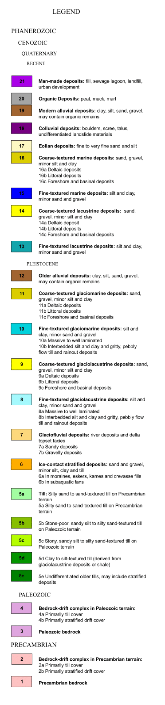

The Ontario Geological Survey's 2010 Surficial geology of southern Ontario has been infilled to capture the extent of the greater ORMGP area. The layer is hosted on the ORMGP image server and is used to distribute potential infiltration rates across the ORMGP jurisdiction. Infilling was accomplished using the OMAFRA [Agricultural Resource Inventory](https://www.arcgis.com/home/item.html?id=cf961d62ee1345c7b191808c9d60a4d7) and is detailed in the [metadata page](/metadata/surfaces/surficial_geology.html). The final product is contiguous across the extended ORMGP area and is used (for instance) to parametrize the ORMGP [water budget model](/interpolants/modelling/waterbudgetmodel.html#land-use-and-surficial-geology).

<iframe src="https://golang.oakridgeswater.ca/pages/surfgeo23.html" width="100%" height="400" scrolling="no" allowfullscreen></iframe>
_ORMGP surficial geology as hosted on our image server_

 

 

The complete OGS legend can be found [here](/metadata/external/ogs/surficial_geology_legend_p26.pdf).

# Raster download

The version 2023 ORMGP surficial geology surface can be found [here](https://www.dropbox.com/scl/fi/zpjn8v71eamaoixlnr9f1/surfgeo23.tif?rlkey=wx7w80qz6efeh19pxitu8uefk&st=5o41wvz6&dl=1). See also the [metadata](/metadata/surfaces/surficial_geology.html).

# References

Ontario Geological Survey 2010. Surficial geology of southern Ontario; Ontario Geological Survey, Miscellaneous Release— Data 128 – Revised.

Ontario Ministry of Agriculture, Food and Rural Affairs. 2022. Agricultural Resource Inventory - Final.