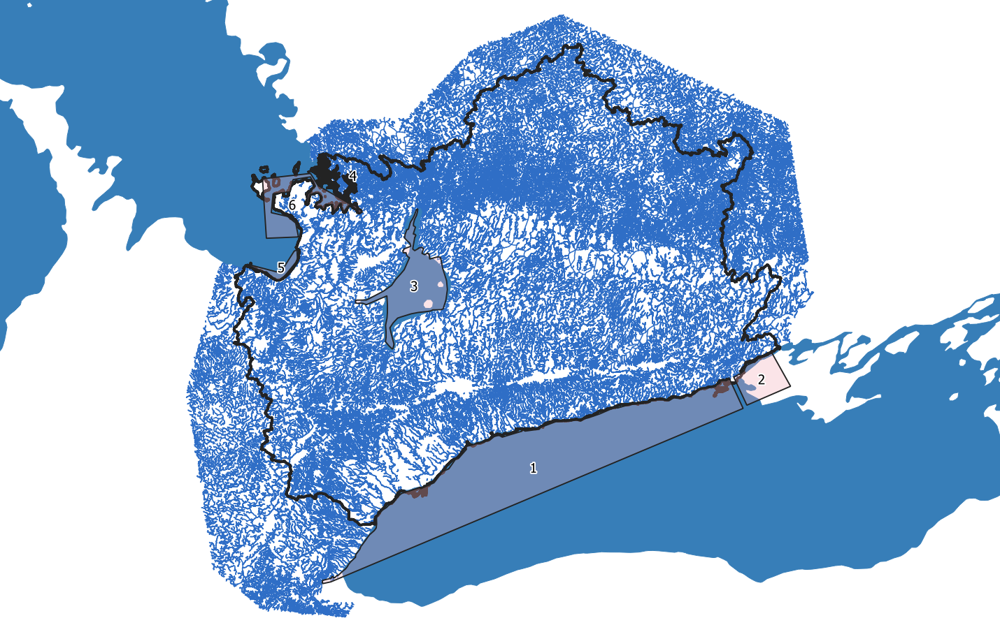

* TOC
{:toc}

# Watercourse Topology
TODO:
* Much of our analysis involves relating monitoring (point data) to stream flow, which exists along linear features
* Below describes an algorithm used to take an arbitrary watercourse map and determine its topology, that this the connectivity and flow direction of linearly mapped watercourse features (i.e., defining downstream vs. upstream directions).
 

## Data Source

[Ontario Hydro Network (OHN) - Watercourse](https://geohub.lio.gov.on.ca/datasets/a222f2996e7c454f9e8d028aa05995d3_26/about) provides the location of watercourses in Ontario and is offered by the Ontario Ministry of Natural Resources and Forestry.

From this, a subset of streams found within our study area is exported:

> data set shown can be found here: [OHN_WATERCOURSE-export.geojson](https://www.dropbox.com/s/a44ohn98h0nkcij/OHN_WATERCOURSE-export.geojson?dl=0)

## Manual Adjustments

In a total of 41 locations, stream segments were manually removed in order to prevent "unnatural" flow connectivity. For instance, Mitchel Lake is the topographical high along the Trent-Severn Waterway. Naturally, water would run away in either direction toward Lake Simcoe to the West and Lake Ontario to the south. Because it's a navigable waterway it is mapped, thus connecting the headwaters of two divergent watersheds.

__*Stream Segments*__ (used here) are the longitudinal lengths of mapped watercourse, ending at each downstream confluence.

## Defining Outlets

The above figure also shows 6 "shoreline" locations, from which the [algorithm](https://github.com/OWRC/drainTopology) searches for any watercourse segments are touching any of these polygons.

From these selected segments, the algorithm searches for upstream segments until a head water feature is found, all the while book keeping the connections each segment has with its neighbouring upstream and downstream segments.

> Defined outlets can be found here: [OHN_WATERCOURSE-export-rootsel.geojson](https://www.dropbox.com/s/djphvjkospckj88/OHN_WATERCOURSE-export-rootsel.geojson?dl=0)

By defining watercourse topology, watercourse properties such as the the Horton–Strahler stream ordering system can be readily applied. Most importantly, any two sampling within our database can be grouped by shared reaches.

> Topologically-correct watercourse layer: [OHN_WATERCOURSE-export-segments.geojson](https://www.dropbox.com/s/0vq92budz1o64pb/OHN_WATERCOURSE-export-segments.geojson?dl=0) 

## Simplification

For computation efficiency, the Douglas-Peucker *Simplify* algorithm found in QGIS was applied to the watercourse layer. The simplify process has the effect dampening sinuosity, thereby shortening stream lengths. In the case, on average, segment lengths shrunk by 2%.

The simplification was set by trial and error to a 10m threshold, reducing the dataset to a manageable 500,000 vertices (X-Y locations; the points are needed for spatial queries).

> Topologically-correct watercourse layer (simplified): [OHN_WATERCOURSE-export-segments-simplUTM.geojson](https://www.dropbox.com/s/u91365p9z32mne8/OHN_WATERCOURSE-export-segments-simplUTM.geojson?dl=0) (epsg:26917)

## Vertex to vertex

For operational purposes, the topological watercourse map has been further reduced to a set of 2-point "line segments", one for every vertex (X-Y location) used to define the entire simplified ORMGP watercourse network.

* There are 80,486 watercourse segments, having an average length of 580m (sd: 610m); made up of
* 485,880 vertices, having a mean distance vertex to vertex 95m (sd: 82m)

> Topologically-correct watercourse layer (simplified, by vertex-to-vertex line segments): [OHN_WATERCOURSE-export-segments-simpl-vertsegs.geojson](https://www.dropbox.com/s/tcrv4wpe9b1oo8j/OHN_WATERCOURSE-export-segments-simpl-vertsegs.geojson?dl=0) (epsg:26917)

## Summary of generated layers

1. [OHN_WATERCOURSE-export.geojson](https://www.dropbox.com/s/a44ohn98h0nkcij/OHN_WATERCOURSE-export.geojson?dl=0) - Crop of original data, with 41 features manually removed for consistency see image above.
1. [OHN_WATERCOURSE-export-rootsel.geojson](https://www.dropbox.com/s/djphvjkospckj88/OHN_WATERCOURSE-export-rootsel.geojson?dl=0) - Polygons from where the algorithm is to begin.
1. [OHN_WATERCOURSE-export-segments.geojson](https://www.dropbox.com/s/0vq92budz1o64pb/OHN_WATERCOURSE-export-segments.geojson?dl=0) - Output of the algorithm: Topologically correct watercourse layer.
1. [OHN_WATERCOURSE-export-segments-simplUTM.geojson](https://www.dropbox.com/s/u91365p9z32mne8/OHN_WATERCOURSE-export-segments-simplUTM.geojson?dl=0) (epsg:26917) or [OHN_WATERCOURSE-export-segments-simplWGS.geojson](https://www.dropbox.com/s/uccllnq3eqnhnd1/OHN_WATERCOURSE-export-segments-simplWGS.geojson?dl=0) (epsg:4326) - The final output currently in operation.
1. [OHN_WATERCOURSE-export-segments-simpl-vertsegs.geojson](https://www.dropbox.com/s/tcrv4wpe9b1oo8j/OHN_WATERCOURSE-export-segments-simpl-vertsegs.geojson?dl=0) (epsg:26917) - The same as above, only broken up into line segments, vertex-to-vertex. Use this only layer is to reveal the geometry associated with the *__segment ID__* used in grouping co-located point observations in our database.

# Source code

See the [GitHub repository](https://github.com/OWRC/drainTopology).

# References

Horton, R.E., 1945. Erosional Development of Streams and Their Drainage Basins: Hydrophysical Approach To Quantitative Morphology Geological Society of America Bulletin, 56(3):275-370.

Strahler, A.N., 1952. Hypsometric (area-altitude) analysis of erosional topology, Geological Society of America Bulletin 63(11): 1117–1142.