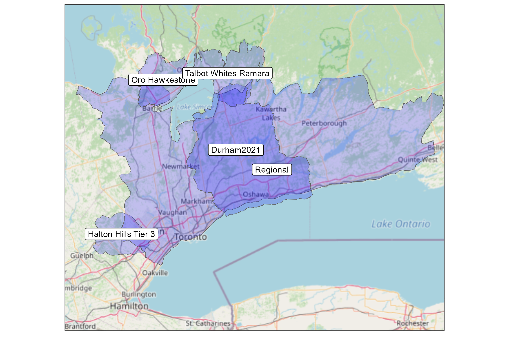

# Introduction

The [ORMGP particle tracking web-tool](https://www.oakridgeswater.ca/) returns both forward and backward sub-surface particle tracks from a user-selected location.  The tool is built upon existing numerical groundwater models which in themselves have organized, synthesized and interpreted a wealth of hydrogeological information (e.g., boreholes, geological mapping, previous studies, etc.) to gain an understanding of the groundwater flow system. 

Here, the results from running these models to a steady state are collected. From these states, a virtual particle can be released in the model domain and its path can be traced.

Particle tracking can prove important and useful from a number of perspectives:
  
- For any groundwater study where degraded groundwater quality has been detected, particle tracking can provide an initial indication of where the degraded water quality might have originated.  An evaluation of backward tracking from the site can help to quickly point out up-gradient land uses that might be contributing to degraded water quality. Forward tracking can indicate potential downgradient areas at risk. More detailed follow up investigations can then be directed to the right areas.

- For proposed development in rural areas, where water supplies are from wells, and where waste water is directed to septic systems, particle tracking is useful for showing the general direction of groundwater flow. The overall development can be designed to avoid having septic systems positioned such that they might affect nearby well water supplies. Even at a site scale, knowing the generalized groundwater flow directions allows for appropriate siting of wells (up-gradient from septic systems) and septic beds (down-gradient of wells).  The particle tracking tool can also reveal potential up-gradient land uses that might have an influence on well water quality in a proposed development.

- Ecological studies, where aquatic organisms are of interest, could also make use of particle tracking.  By examining the backward particle tracking from streams, existing or proposed land uses that might affect stream water quality can be assessed, and potential mitigation proposed. Ecologically Groundwater Recharge Areas (EGRA, *formerly ESGRA*) make use of such particle tracks to link recharge to discharge areas.  If new important ecological stream reaches are identified, then preliminary delineation of EGRAs can be made using the tool.  This can lead to early mitigation activities.

- Cross-boundary groundwater flow: Particle tracking is an informative way to visualize groundwater flow pathways from the point of recharge to the point of groundwater discharge.  Below, for example, a source water protection model had reverse particles tracking back from a groundwater dependent wetland.  Notice how, according to the model, the water that feeds the wetland originate well outside the surface water catchment area outlined in black.  Meaning: the wetland depends on sources outside the watershed it resides.

# Numerical Model Selection

As the ORMGP continually adds numerical models into our [Numerical Model Custodianship Program](https://owrc.github.io/snapshots/md/numerical-model-custodianship-program.html) they become available for inclusion into the particle tracking tool. Not all models are included into the tool, but are included either by request, or simply for the sake of covering as much of our jurisdiction as possible.

As of the date of this snapshot (listed below), the particle tracking from the following models have been made live online:
  
1. Regional model (MODFLOW)
1. Halton Tier-3 (FEFLOW)
1. Oro-Hawkestone (MODFLOW)
<!-- 1. South Halton (MODFLOW) -->
<!-- 1. CVC (FEFLOW) -->
<!-- 1. NVCA-SSEA (FEFLOW) -->
<!-- 1. Ramara Whites Talbot (MODFLOW) -->
<!-- 1. York Tier-3 (MODFLOW) -->
<!-- 1. Durham (MODFLOW) -->

# Methodology

## Numerical groundwater flow models

The "Long-term average" flux fields of the above models were computed by running each model (in their delivered form) to a steady state. This produces a standard numerical model *output*.  From these outputs, the particle tracking methodology is applied.

Numerical groundwater flow models are constructed by discretizing the subsurface system into a set of prisms stacked together. Each prism can have their own dimensions, a volume, that tends to remain immutable for the duration of the model run (at least in the case of Source Water Protection models built in Southern Ontario).  Thicknesses of every prism tend to be representative of the thickness of the hydrostratigraphic unit (layer) it resides. Each prism is specified with material properties (conductivity, specific storage, etc.) which themselves tend to be immutable (again in SWP models).  The stacking of prisms creates a contiguous model domains, leaving no gaps in its interior.

*from Langevin et.al., 2017*

 

There are 2 fundamental model "types" typically applied in water resources: Finite Difference (FD) models (i.e., MODFLOW) and Finite Element (FE) models (i.e., FEFLOW, HydroGeoSphere). In source water protection, both types have proved more than sufficient to meet provincial guidance and planning demands.  However, when it comes to particle tracking, the model type plays a large role in how model results are to be interpreted.

Finite Element (FE) models used in groundwater modelling in southern Ontario are entirely built using a triangulated irregular network covering the land surface. From this FE mesh, hydrostratigraphic layers are built, resulting in a stacking of *triangular* prisms. 

> *Hereinafter, FD cells/prisms and FE elements will be referred to as simply "cells"*.

## Flux Field

A result of running a groundwater flow model to steady-state is a 3D "flux field"; this can be though of as a 3-dimensional distribution of points in space where the direction and magnitude of groundwater flow velocity is computed. Simply put, particle tracking algorithms take these points of "known" flux vectors and computes/interpolates flux values anywhere in space, not just the location of model cells.

However, in reality, FD and FE models have different means of defining flux fields:

### Finite Difference

A typical output for FD models is that flux is reported across every *face* of the model cell, meaning that mass is conserved at every cell.

*from Pollock, 1989*

 

### Finite Element

For FE models, in particular FEFLOW, *3D flux vectors* are reported at the element nodes.  These flux vectors can be interpolated/averaged to the element centroids is and is assumed constant throughout the spatial extent of the prismatic element.

This vector-based realization of an FE flux field does not guarantee mass balance at the elemental level, however mass ballance is maintained over the entire model domain (Diersch, 2014).

## Particle tracking

At every model prismatic cell, including all cells in each layer right to the base of the model, a virtual particle was placed at th cell's centroid (or top of water surface, whichever is less, in the up-most layer cells that are is partially saturated).  Particles from these startpoints are tracked forward and backward thus yielding *a collection of particle pathlines that pass through the centroid of at least one model cell*.  FDor this reason, these are here termed __*"Centroidal Particles"*__.

Particles are tracked through the steady-state flow field using the semi-analytical Pollock (1989) method for the MODFLOW models, and a vector triangulation scheme for the FEFLOW models. [*Source code for the particle tracking algorithms can be found here*](https://github.com/maseology/ptrack).

Please note that there are many particle tracking methodologies and algorithms, we have chosen a convenient methodology to permit particles to be shown on the website.

Numerical model cell/element size/orientation will all have effects on the particle pathline calculation.

# Centroidal Particle Web-tool

The particle tracking web tool API keeps in memory the collection of pre-computed centroidal particle pathlines in the form of a topological network (i.e., a directed graph) that has very efficient retrieval rates (in other words, the return of pathlines from a user-selected startpoint is extremely *fast*).

Keep in mind that the forward and backward particle traces that are shown on the website include traces from each model layer right to depth (not just from any particular model layer).  Note that colour coding is employed to differentiate reverse (up-gradient) pathlines from forward (down-gradient) pathlines.

Pathlines are in fact built upon a set of pathline vertices (points) that themselves have knowledge of upstream and downstream vertices. Once a chain of related vertices are collected, a pathline is formed. This has the advantage of locating all pathlines that cross a user-clicked location, no matter where the centroidal particle originate.

Particles vertices are additionally attributed with:
  
1. Tracking time (from their startpoint);
1. Model layer the reside; and
1. Particle startpoint.

 

### Example: The "Regional" model

The Regional model is a large (14,500 km²) coarse (240 m cell) 5-layer MODFLOW model that covers the bulk our our jurisdiction. In all, the model consists of 1.3M FD cells, from each a particle was released at its centroid.  

The following figures show the results of a cell being clicked by a user on our mapping tools:

And zooming in around the particle tracks:

Now, even though there are only 5 centroidal pathlines originating at this clicked location/cell (one for every layer), many (of the 1.3M) pathlines originating from cells not clicked appear to cross the clicked cell; the particle tracking API captures all pathlines that cross this clicked cell. This gives a nice way to see a number of pathlines that could originate from a particular cell without explicitly computing them.

<iframe src="https://golang.oakridgeswater.ca/pages/443405-3D.html" width="100%" height="400" scrolling="no" allowfullscreen></iframe>

 

## Data Compression

To further improve user performance, particle pathlines from larger models (say, >2M cells) have to be simplified to reduce data size (i.e., data compression). As a rule of thumb, the particle tracking web tool performs best when the pathline file remains less than 2GB memory. 

These pathline files (outputted as a _"gob file"_ or [Go Binary](https://pkg.go.dev/encoding/binary): _\*.gob_) consist of a set of vertices each with knowledge of their neighbour vertices (either up and down gradient of the current location). It is these relationships that define the pathlines yet enable the user to take any point along a centroidal pathline and track from there.

There are three ways these data are compressed:
  
1. Removing excess detail, such as vertices in close proximity, and using polyline smoothing schemes.
    - Here the so-called [Ramer-Douglas-Peucker algorithm](https://en.wikipedia.org/wiki/Ramer%E2%80%93Douglas%E2%80%93Peucker_algorithm) was applied with a 10m threshold
1. Removing pathlines originating from cells in thin (or "pinched-out") layers.
1. Systematically removing whole pathlines
    - random pull: simply removing every $\text{n}^{th}$ pathline at random
    - minimum cell-area threshold (full exclusion, or random pull)
    - quality thresholds (FE meshes only, aspect ratios, Delaunay criterion, etc.)

 

# System test

<iframe src="https://owrc.shinyapps.io/ptrack/" width="100%" height="400" scrolling="no" allowfullscreen></iframe>

 

# References

Diersch, HJ.G. (2014). Discrete Feature Modeling of Flow, Mass and Heat Transport Processes. In: FEFLOW. Springer, Berlin, Heidelberg. [https://doi.org/10.1007/978-3-642-38739-5_14](https://doi.org/10.1007/978-3-642-38739-5_14)

Langevin, C.D., Hughes, J.D., Banta, E.R., Niswonger, R.G., Panday, Sorab, and Provost, A.M., 2017, Documentation for the MODFLOW 6 Groundwater Flow Model: U.S. Geological Survey Techniques and Methods, book 6, chap. A55, 197 p., [https://doi.org/10.3133/tm6A55](https://doi.org/10.3133/tm6A55).

Pollock, D.W., 1989, Documentation of a computer program to compute and display pathlines using results from the U.S. Geological Survey modular three-dimensional finite-difference ground-water flow model: U.S. Geological Survey Open-File Report 89–381.

