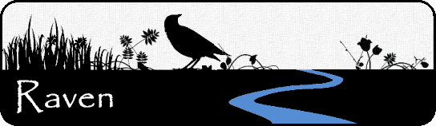

A regional semi-distributed rainfall-runoff model has been developed to simulate regional-scale hydrologic processes at the sub-watershed scale. The model is developed using Raven: a state-of-the-art [hydrological framework](https://raven.uwaterloo.ca/) written by Dr. James Craig at the University of Waterloo. In particular, the HBV-EC formulation is applied as its results can be mapped to the 60x60 grid used with the integrated [Water Budget model](/interpolants/modelling/waterbudgetmodel.html).

The model was initially built to support the Water Budget (recharge) model in that it is built on the same [sub-watershed network](/interpolants/interpolation/subwatershed.html), [land-use](/interpolants/interpolation/landuse.html), [surficial geology](/interpolants/interpolation/surfgeo.html) and [climate forcings](/interpolants/sources/climate-data-service.html). With this *traditional* hydrologic model, results are indeed similar--although at the moment more calibration is required.

# Model Design

The model is built off the same 4,230 sub-watersheds used in the climate data service and the integrated water budget model. Raven (HBV-EC) uses the semi-distributed *Hydrological Response Unit* (HRU) formulation which groups the land surface into common climate, land use, and surficial geology categories. After grouping unique permutations, the 12.4M grid cells analyzed in the water budget model are reduced to 18,515 distinct HRUs. The model then computes the hydrology of these HRUs and the results are then mapped back to the original grid. This reduction to HRUs greatly improves model run times.

The latest model build can be found [here](https://github.com/OWRC/OWRC-Raven).

### Additional build notes

- Sub-watersheds where >80% of their area is covered by waterbodies and wetlands and where waterbodies are the dominant feature (i.e., greater coverage than wetlands) are deemed lake sub-watersheds.
- HRUs defined in each sub-watershed (as a unique combination of land use and surficial geology combinations) that do not cover 5% of the sub-watershed area are excluded from the model and are assumed to take the average results from the remaining sub-watershed.
- Model is run in daily time steps from October 1993 through September 2023.

> WARNING: The model currently remains largely un-calibrated.

## Comparison to an Integrated Water Budget

While a standard in the hydrological community, models such as Raven are designed to neglect the role of groundwater influence on runoff generation. In most cases this can be a fair simplification, especially during the onsets of extreme rainfall events, which is likely the most prominent use case of such models. The problem is that in many areas (of southern Ontario), [water tables are close to (or even above) ground surface](/watertable/). What this means is that recharge cannot occur in these areas yet standard hydrological models fail to account for this. In practice, areas where seepage is known to occur, such as wetlands (fens), modellers are forced to "effectively" treat wetlands as an impervious surface. Computationally, wetlands are thus no different than a parking lot.

By design, integrated models treat the water table explicitly and so no effective treatment of the exchange of water between the subsurface and ground surface is required. Modeller discretion is eliminated and a physical treatment of the hydrological system is maintained. Below is an illustration of a Raven output with that of the ORMGP [integrated water budget model](/interpolants/modelling/waterbudgetmodel.html). Notice how features such as streams become an emergent property of the landscape gaining groundwater discharge as baseflow, not a feature built into the model.

<iframe src="https://golang.oakridgeswater.ca/pages/Raven23WB-compare.html" width="100%" height="400" scrolling="no" allowfullscreen></iframe>

_Comparison of groundwater recharge simulated using Raven vs. an integrated groundwater/surface water model (mm/yr). Notice how in the integrated case much of the low lying areas exhibit negative "net recharge", meaning that these are area where water tables are high and seepage to the surface is being simulated._

# Contact

Should more information on the model wish to be known or if a subset of the model wish to be used, please contact support@owrc.ca.

# Other resources:

- [**RavenView**](https://raven.uwaterloo.ca/RavenView/RavenView.html) is an online tool Raven users can use to view model results.
- [**RavenR**](https://raven.uwaterloo.ca/RavenR.html) is an [__*R*__](https://www.r-project.org/) package that can be used to build Raven models and report results.