The regionally-distributed runoff-recharge model was designed on the premise that computational efficiency should be maximized while maintaining a sound representation of hydrological processes. This is based on the fact that no model is a perfect representation of reality and that all models will fail to make a perfect match for reality. Instead, models can only get close to reality, and worst yet, many versions of models can get just as close to reality. Distributed models, like the one proposed, suffer even more as there are countless variants of model parameterizations that will also come close to reality; this is the non-uniqueness problem. 

One path to handle non-uniqueness is to attempt to sample the full variability of possible parameter sets, each of equally variable according to the few observation points available. Accomplishing such sampling requires many, many model runs; many model runs require fast runtimes. 

This page is a test on the efficiency of the model. Here, the model runtimes are compared with standard off-the-shelf numerical models of varying types/applications. This is *not* a test of model performance in terms of their ability to represent reality, rather it is purely a test of computational efficiency.

 

**Contents**

* TOC
{:toc}

## Study Site

 

The study site chosen is a medium-scale watershed with a 35-year daily streamflow record. The catchment has 2 distinct physiographies, above and below the niagara escarpment.

 

## Benchmarking: off-the-shelf models

Models of varying complexity have been selected to compare with the regionally-distributed runoff-recharge model. The models are distinct in character, in level of complexity. The model types include:

1. Artificial Neural Network
1. Lumped rainfall-runoff models
1. HRU-based model
1. distributed hydrologic model
1. 2D hydraulic model
1. Integrated groundwater/surface water model

 

### Artificial Neural Network

$$
    \hat{Q}_t=E \left\{ Q_t | Q_{t-1}, Q_{t-2}, \dots , \\ Q_{t-n}, P_t, P_{t-1}, \dots , P_{t-n}, f(\cdot) \right\}
$$

where $Q_t$ is discharge at time $t$, $P_t$ is precipitation at time $t$, and $f(\cdot)$ is a [sin curve PET function](/info/evaporation/#sine-curve) relating to the time of year.

**Test:**

- 61 input layers $(n=30)$ + 2 hidden dense layers x 5 nodes per layer + 1 output layer
- 1,989 epochs over daily timeseries of 12,565 timesteps
- Training 14:59
- NSE 0.74

 

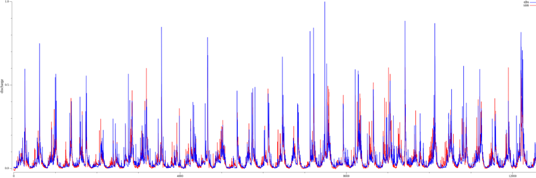

*Trained hydrograph from the ANN (NSE 0.74).*

 

### Lumped Rainfall-Runoff models

<!-- 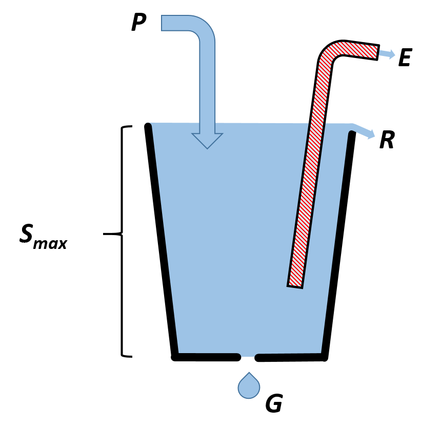 -->

*Lumped models are often called the "Bucket Model" as they can be conceptualised as a above.*

 
 
$$
    P = E + R + G
$$

where $P$ is precipitation, $E$ is evaporation, $R$ is runoff and $G$ is groundwater recharge. *Note: The water balance equation as written in the long-term form where changes to water storage $(\Delta S)$ becomes negligible.*

**Test:**

- 12,596 time steps
- 6 models:
    - Atkinson et.al. (2003)--NSE: 0.40, runtime: 15.99ms
    - Dawdy and O'Donnell (1965)--NSE: 0.36, runtime: 3.50ms
    - GR4J (Perrin et.al., 2003)--NSE: 0.46, runtime: 7.18ms
    - HBV (Bergström, 1976)--NSE: 0.45, runtime: 4.00ms
    - Manabe (1969) with a linear baseflow reservoir--NSE: 0.40, runtime: 3.59ms
    - SPLR (Buytaert and Beven, 2011)--NSE: 0.49, runtime: 3.67ms

 

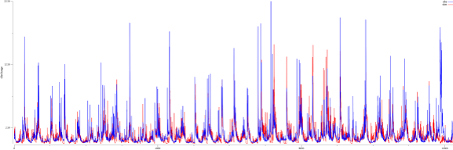

*Sample hydrograph from the (lumped) HBV model (NSE: 0.45).*

 

### HRU-based model

A second version of the HBV model tested is based on the Hydrological Response Unit (HRU) concept where the watershed is divided into a number of sub-units:

<!-- 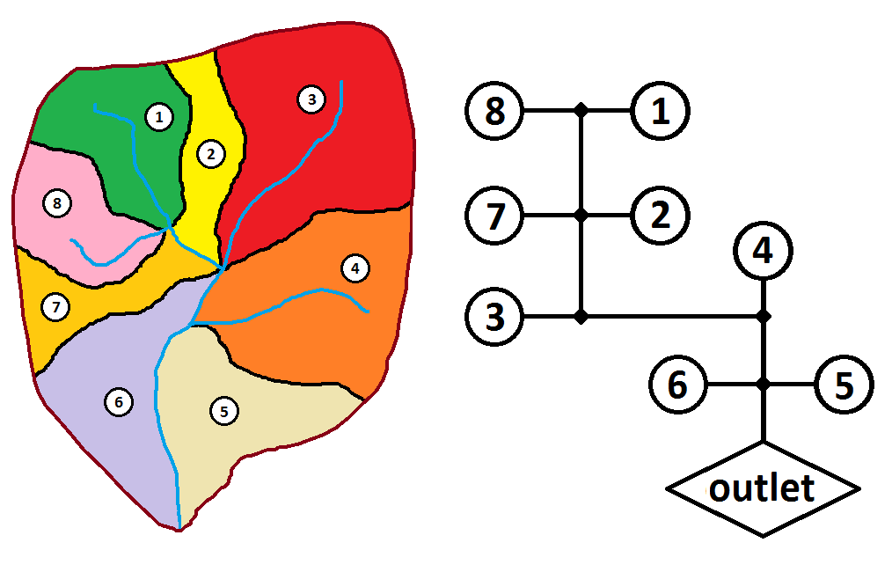 -->

*An example of the HRU concept: Left shows a watershed divided into 8 sub-catchments; Right:shows the same system shown graphically. Essentially, the model is composed of 8 lumped models that are parametrized independently and runoff aggregated to math know outlet discharge.*

 

$$
    \sum_i^n P_i = E_i + R_i + G_i
$$

Here, the water balance equation is the lumped version, only we are summing the summing the components over $n$ HRUs.

**Test:**

- Built using [Raven](https://raven.uwaterloo.ca/).
- 8,034 d, 21 sub-basins, 84 HRUs
- Runtime: 4.844 seconds
- *Model not calibrated*

 

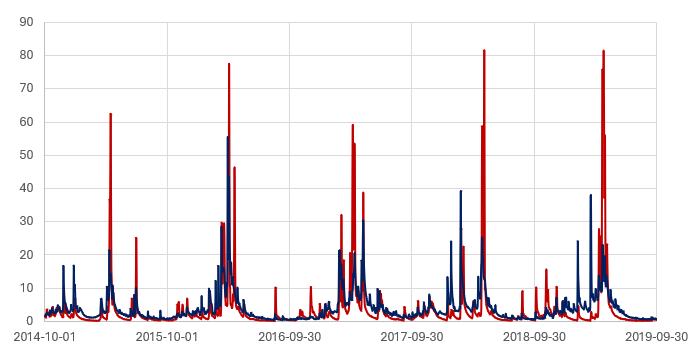

*Sample hydrograph from the (HRU-based) HBV-EC model (built using Raven).*

 

### Distributed model

[PRMS](https://www.usgs.gov/software/precipitation-runoff-modeling-system-prms) is the test case for a distributed hydrologic model.

<!-- 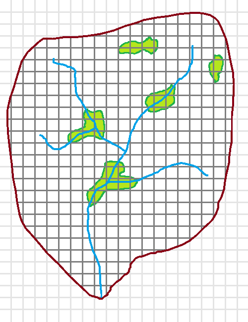 -->

*A conceptual example of a distributed watershed model domain.*

 

$$
    P_i + O_i = E_i + R_i + G_i
$$

Here, the water balance equation is modified in that the subscript $i$ is representative of a model cell index. The new term $O_i$ is "runon": Runon on cell $i$ is the runoff from some up-gradient cell $j$.

**Test:**

- Run in distributed mode (70,615 60x60m cells)
- 6,848 d
- Runtime: 7 minutes 10.17 seconds
- *Model not calibrated*

 

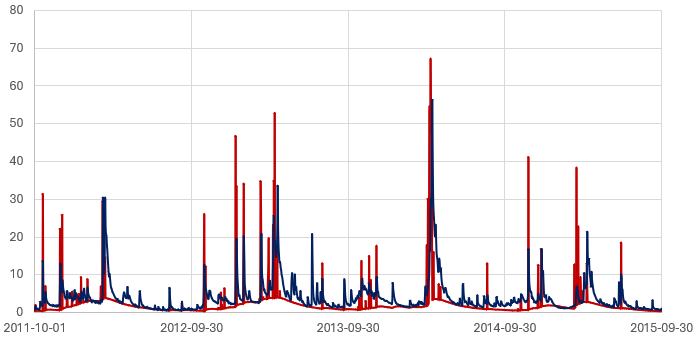

*Sample hydrograph from the (distributed) PRMS model.*

 

### 2D hydraulic model

[GSSHA](https://gsshawiki.com/Gridded_Surface_Subsurface_Hydrologic_Analysis) is the test case for a distributed shallow water equation model.

<!-- 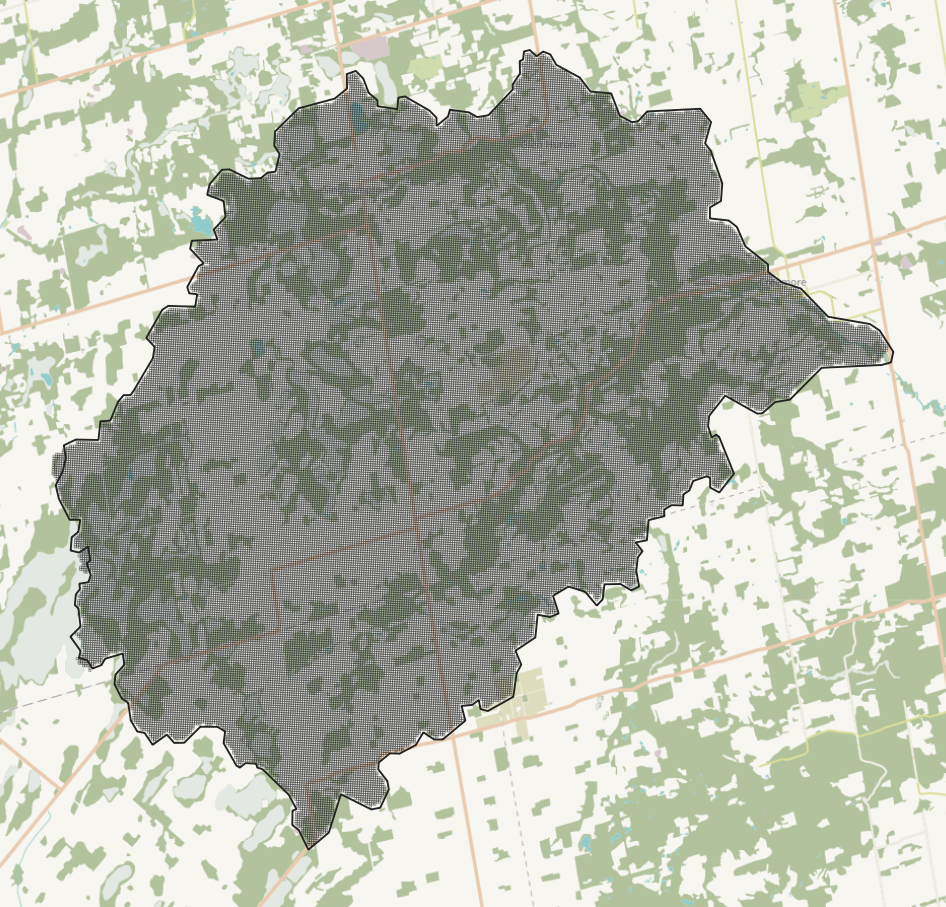 -->

*The gridded watershed model domain used with both PRMS and GSSHA.*

 

$$
    P_i + O_i = E_i + R_i + G_i
$$

The above equation is written the same as the distributed form although the runoff $R_i$ and runon $O_i$ terms moves in 2-dimensions.

**Test:** 

- 70,615 60x60m cells (same as used with PRMS)
- 15 minute timestep, for 1 day
- Diffusive wave equation, Green Ampt infiltration
- Runtime: 338.24s
- *Model not calibrated*

 

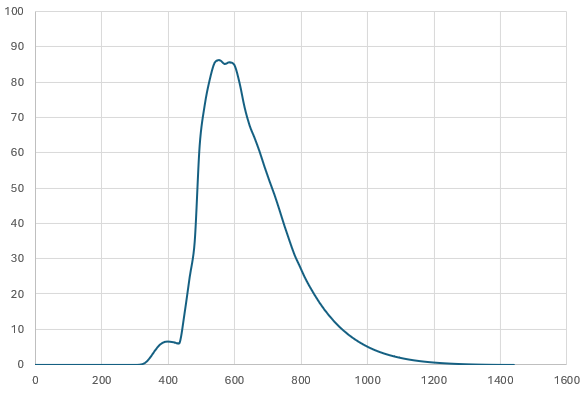

*Sample hydrograph from the GSSHA model. Discharge in m³/s, time in minutes.*

 

### Integrated model

[HydroGeoSphere](https://www.aquanty.com/hydrogeosphere) (HGS) is the test case for a distributed shallow water equation model.

<!-- 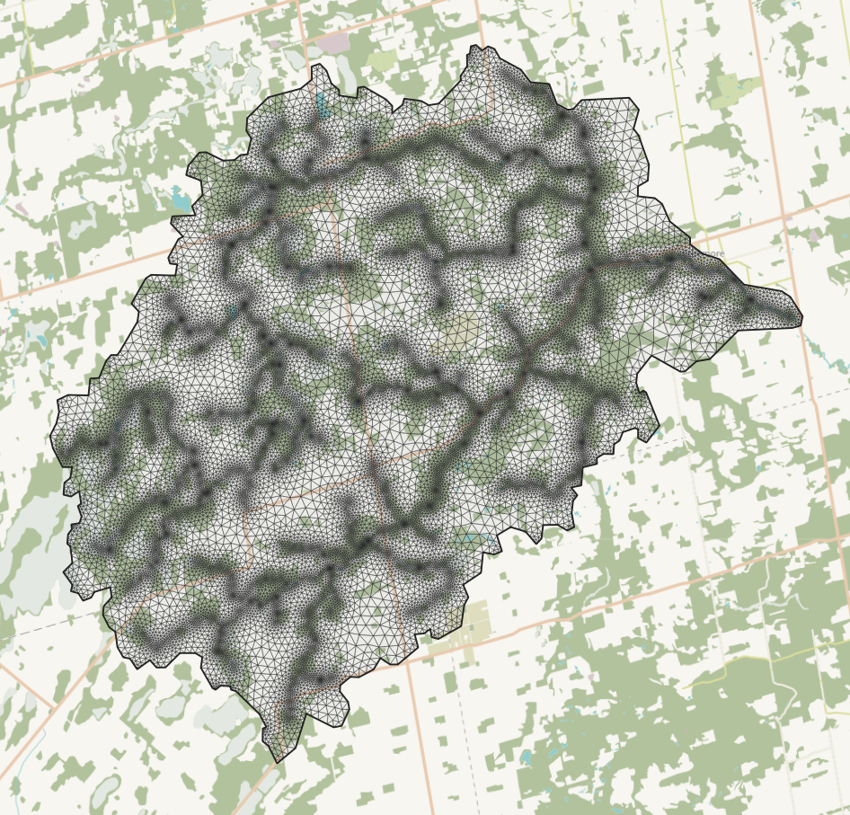 -->

*The irregular triangle network model domain used with HGS.*

 

$$
    P_i + O_i + D_i = E_i + R_i + G_i
$$

Here, another term is introduced: $D_i$ is the groundwater discharge term that occurs when the water table exceeds the ground surface:

<!-- 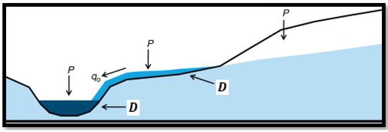 -->

 

**Test:** 

- 28,727 nodes (56,841 elements) x 5 sub-surface layers
- 15 minute time steps, for 1 day
- Runtime: 573.28s
- *Model not calibrated*

 

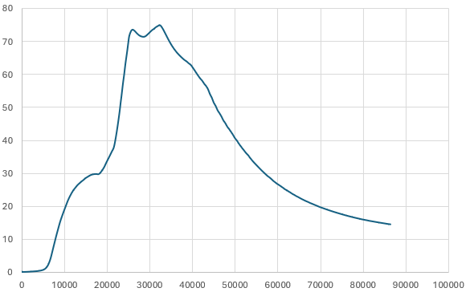

*Sample hydrograph from the HGS model. Discharge in m³/s, time in seconds.*

 

## Benchmarking: The Regionally-Distributed Runoff-Recharge model

From a water balance perspective, the Regionally-Distributed Runoff-Recharge model is equivalent to the integrated model. Details on the model design can be found [here](/interpolants/modelling/waterbudgetmodel.html).

$$
    P_i + O_i + D_i = E_i + R_i + G_i
$$

**Test:** 

- 101,369 50x50m cells
- 27,390 (6hr) time steps
- Runtime: 75s
- *Model not calibrated*

 

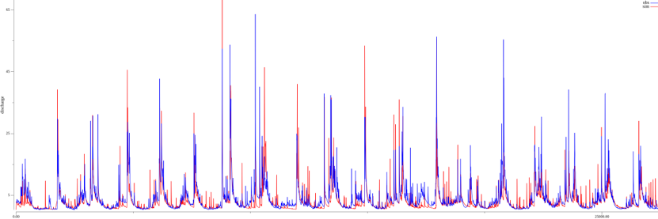

*Sample hydrograph from the RDRR model. Discharge in m³/s.*

 

# Results

Below is a comparison of model performance as it relates to computational performance, *not with respect to the models' ability to match observation*. All models were run on an Intel(R) Core(TM) i5-4670K CPU 3.40GHz, 4 Cores/4 Logical Processors. 32GB RAM.
 

## Simulation time

The first evaluation of model performance is the ratio of simulation time to wall time (s/s). Simply put, to model an event or some time period of given length will take time to run. The time a model take to complete its simulation is called the "wall time" $(t_w)$. The ratio is defined as:

$$
    \frac{n_t \cdot \Delta t}{t_w}
$$

where $n_t$ is the number of time steps simulated and $\Delta t$ is the time step length.

<!-- 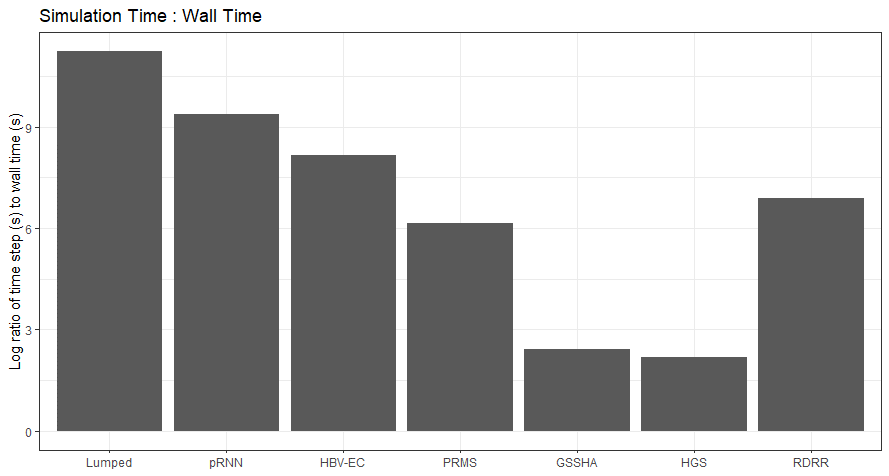 -->

*Ratio of simulation time to wall time. Note the y-axis is in a Log scale.*

 

Above we see that in general, the greater the model complexity, the lower the ratio--this is the main reason why simple models tend to be preferred for continuous hydrological modelling applications.

The regionally-distributed runoff-recharge model (RDRR) fits somewhere between the HRU and distributed hydrological model. But clearly, optimizations can be further made by adjusting the scale (e.g., grid cell size) of the model. The plot above can be normalized by the number of computational elements (i.e., cells, nodes, HRUs, etc.) involved in the models computation:

$$
    \frac{n_e \cdot n_t \cdot \Delta t}{t_w}
$$

where $n_e$ is the number of computational elements.

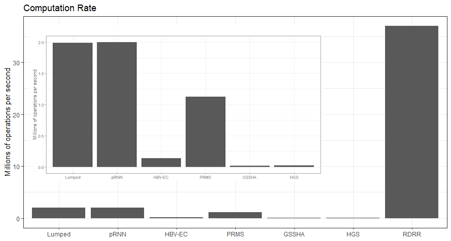

*Ratio of normalized simulation time to wall time. Inset shows plot without RDRR.*

 

## CPU utilization

Below is a comparison of a model code's ability to utilize the full potential of a computer's resources. Simply put, more computations are made when the computational resources are maximally utilized. Event though solver-type models (i.e., GSSHA, HSA, etc.)--that is models that solve partial differential equations--can successfully apply parallelism into their algorithms (e.g., [OpenMP](https://www.openmp.org/)), they are nonetheless attempting to parallelize solvers that require many serial operations, because the model domain is being solved as a whole. As per Amdahl's law, any gain from parallelism is limited by the serial portion of an algorithm. 

As shown below, only the regionally-distributed runoff-recharge model achieves 100% CPU utilization, leveraging to full capability of computer processor resources.

#### GSSHA (OpenMP)

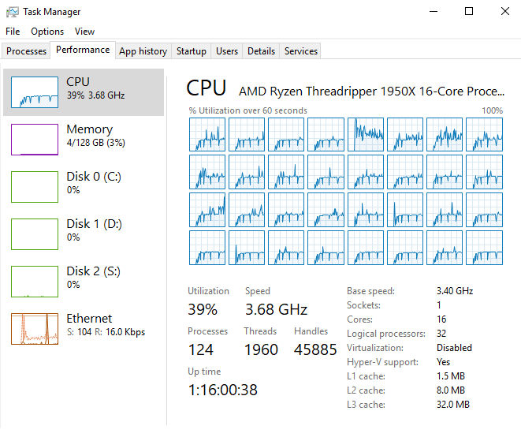

#### HGS (parallel mode with 8 threads)

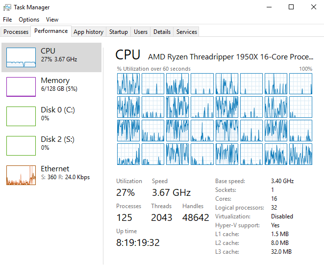

#### RDRR

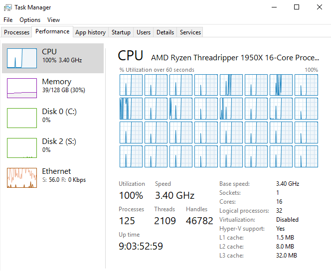

 

# References

Atkinson, S.E., M. Sivapalan, N.R. Viney, R.A. Woods, 2003. Predicting space-time variability of hourly streamflow and the role of climate seasonality: Mahurangi Catchment, New Zealand. Hydrological Processes 17. pp. 2171-2193.

Bergström, S., 1976. Development and application of a conceptual runoff model for Scandinavian catchments. SMHI RHO 7. Norrköping. 134 pp.

Buytaert, W., and K. Beven, 2011. Models as multiple working hypotheses hydrological simulation of tropical alpine. Hydrological Processes 25. pp. 1784–1799.

Dawdy, D.R., and T. O'Donnell, 1965. Mathematical Models of Catchment Behavior. Journal of Hydraulics Division, ASCE, Vol. 91, No. HY4, pp. 123-137.

Perrin C., C. Michel, V. Andreassian, 2003. Improvement of a parsimonious model for streamflow simulation. Journal of Hydrology 279. pp. 275-289.

Manabe, S., 1969. Climate and the Ocean Circulation 1: The Atmospheric Circulation and The Hydrology of the Earth's Surface. Monthly Weather Review 97(11). 739-744.
