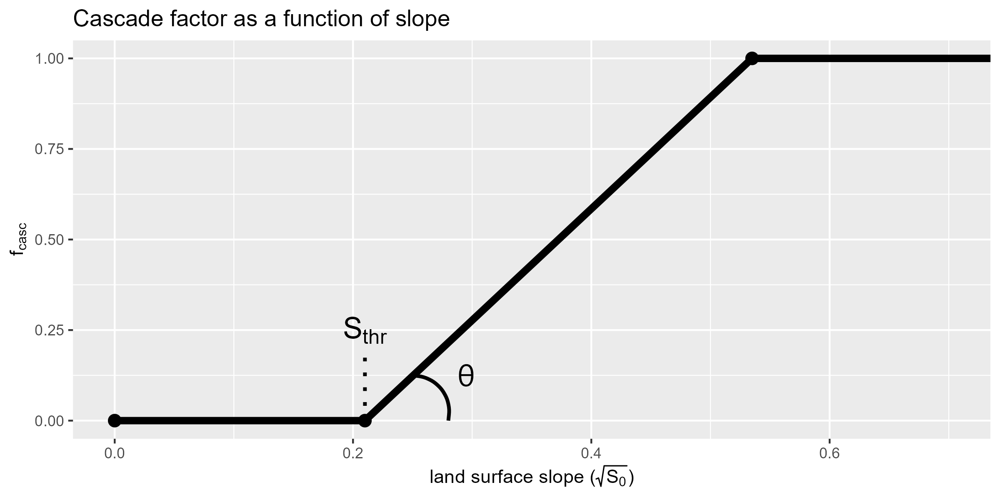

The overland flow process is built for performance. While, many liberties are taken that may constrain its applicability, it exists because we are interested in:

 1. the fine scale spatial distribution of the land surface water budget; that includes,
 2. groundwater feedback, i.e., the ability to induce saturation excess (Dunnian) runoff; to give further insight into
 3. the role and seasonality of groundwater/surface water interaction at the model cell scale; which dictates,
 1. the role and seasonality antecedent moisture patterns and its impact on runoff generation.

The overland flow model is dependent on [topography](/interpolants/interpolation/overland.html) both in terms of it's lateral direction of flow and rate if discharge. It is called a *"cascade"* model because runoff from a model cell is routed and become *"runon"* to a downslope cell. Routing following the $D8$ algorithm (O'Callaghan and Mark, 1984) takes runoff computed at a cell, and adds it as runon to the adjacent model cell having the steepest decent.

Hydrological correction has been applied to the digital elevation model (DEM) which means that the derived routing model will always drain to a model boundary, and land surface swales are always assumed to drain. (*This is matter of choice, and is not a limitation to the routing model; only users should be aware of the issues arising from swales in a cascade network. See [cascade-towers](#cascade-towers) discussion below.*)

A property of the cascade is that when it involved a sequence of many linear reservoirs, the movement of water resembles a kinetic system, a concept known as the Nash model (Nash, 1957). Consequently, the model cannot have any back-water effects or inertial effects.

 

*The "Nash Cascade" (after USACE, 1994).*

 

<!-- From the [Soil Moisture Accounting scheme](/interpolants/modelling/waterbudget/sma.html), the water budget of the "mobile storage" reservoir is defined as:

$$
  \Delta S_k=k_\text{in}+f_h+b-\left(a_k+f_k+k_\text{out}\right)
$$

  -->

# Runoff coefficient

Laterally moving water leaving the cell $(k_\text{out})$ is corrected based on land surface slope. Water leaving a cell can only be directed to a single cell, but any cell can receive from multiple cells. A "*cascade factor*", $F_\text{casc}\propto f(\text{slope},\text{roughness},\text{etc.})$, where $0\leq F_\text{casc} \leq 1$, is applied to the excess volume stored in the mobile store (in the form of a *linear reservoir*):

$$
  k_\text{out}=F_\text{casc}S^+,
$$

where $S^+>0$ is water in the detention store in excess of the store's capacity. 

## Cascade factor

The cascade factor $(F_\text{casc})$ is assumed related to land surface slope using some functional relationship. Two methods are trialled in the ORMGP area: the Gaussian method and the Threshold method

### Gaussian method

Here, $F_\text{casc}$ is assumed to be related to slope given the exponential relationship:

$$
  F_\text{casc}=1-\exp\left(\frac{S_0^2}{-\alpha}\right),
$$

where $S_0$ is land surface gradient and $\alpha$ is a scaling parameter. (Note that the above equation is identical to the Gaussian variogram kernel with a unit range.)

<!-- $$
  F_\text{casc}=1-\exp\left(-a\frac{\beta^2}{r^2}\right),
$$

where $\beta$ is land surface gradient, $r$ is called the "range" (note that the above equation is identical to the Gaussian variogram model), and $a$ is a scaling factor applied to the range such that it's value approaches unity at $r$. ; Below are examples with $a\approx 5$: -->

 

*$F_\text{casc}$ is assigned as a function of slope. Above shows the affect of varying $\alpha$ within the range of gradients found local to the ORMGP (see histogram below).*

 

### Threshold method

Here, $F_\text{casc}$ is assumed to be related to slope given the piecewise function:

$$
  F_\text{casc}=
  \begin{cases}
    0 \qquad & 0\leq \sqrt{S_0}\leq S_\text{thr}\\
    (\sqrt{S_0}-S_\text{thr})\cdot\tan{\theta} & S_\text{thr}\lt \sqrt{S_0}\lt S_\text{thr} + \tan^{-1}{\theta}\\
    1 & \text{otherwise} 
  \end{cases}
$$

Where $S_\text{thr}$ is the *threshold* surface gradient when runoff occurs and $\theta$ is a scaling parameter $[0,\pi/2]$.

 

*$F_\text{casc}$ is assigned as a function of slope threshold $S_\text{thr}$ and scaling parameter $\theta$.*

 

## Constraining $F_\text{casc}$

As applied to the model, $F_\text{casc}$ is further constrained to a subset of $[0,1]$ using the linear re-scaling:

$$
  \hat{F}_\text{casc}=(F_\text{cx}-F_\text{cn})F_\text{casc}+F_\text{cn}
$$

$$
  0 < F_\text{cn} < F_\text{cx} <1 
$$

Meaning the model will always maintain some (small) runoff $(\hat{F}\_\text{casc}=F\_\text{cn}\approx 0.001)$ and $F_\text{cx}$ can be though of as a **_runoff coefficient_**.

## Special conditions

Special conditions are set for $F_\text{casc}$: All stream cells have $F_\text{casc}=1$, meaning that the the mobile water store remains 100% mobile.

Urban areas that are assumed serviced also have $F_\text{casc}=1$ but also have their runoff routed directly to the nearest stream cell; meaning that within a timestep, municipal servicing adequately drained the urban area to it's likely stormwater discharge point. This is termed a cascade *"Urban Diversion"*.

 

## Cascade network

*Model close-up showing the granularity of the overland flow routing scheme. Flow primarily runs along the purple tracks, but in serviced areas, runoff is directly routed to streams (red).*

 

## In Summary

The $D8$ algorithm produces a dendritic network of overland flow paths whose rate of discharge depends on $F_\text{casc}$:
- stream cells: $F_\text{casc}=1$
- urban cells: $F_\text{casc}=1$ (assumes serviced areas)
<!-- - all else $F_\text{casc}=1-\exp\left(\frac{\tan^2\beta}{-\alpha}\right)$,  where $\tan\beta$ is the local surface slope. -->
<!-- - all else $F_\text{casc}=1-\exp\left(\frac{S_0^2}{-\alpha}\right)$,  where $S_0$ is the local surface slope. -->
- all else $F_\text{casc}\alpha\sqrt{S_0}$,  where $S_0$ is the local surface slope.

 

*When comparing the distribution of land surface gradient to a calibrated cascade factor function it's apparent that lateral movement of overland flow is not a dominant process for most of the landscape.*

 

### Cascade "Towers"
The cascade routing scheme built this way created issues in flat regions and land surface swales (low points on the land where runon os received from all direction). This can lead to unrealistic water depths $(\gg100\text{m})$.

One way to avoid this is to use a hydrologically-correct DEM, as done here. But this does not solve the tower problem as it can occur in flat regions in particular where a convergence of cascade flowpaths. In the model, excess storage is infiltrated assuming a falling head through a unit length back into the groundwater system:

<!-- $$
  g=S_k^+\left[1-\exp(-K_\text{sat}\Delta t)\right],
$$ -->

$$
  g=S^+\left[1-\exp\left(\frac{-K_\text{sat}}{L}\Delta t\right)\right].
$$

where $K_\text{sat}$ is saturated hydraulic conductivity of the surficial soils, and $\Delta t$ model timestep (s). This appears to resolve towers here. *(see also [groundwater recharge](/interpolants/modelling/waterbudget/sma.html#groundwater-recharge).)*

# References

Nash, J.E., 1957. The form of the instantaneous unit hydrograph. IAHS Publication 45(3), 114–121.

O'Callaghan, J.F., and D.M. Mark, 1984. The extraction of drainage net-works from digital elevation data, Comput. Vision Graphics Image Process., 28, pp 328-344.

USACE, 1994: Engineering and Design – Flood-Runoff Analysis, Department of the Army U.S. Army Corps ofEngineers Washington, DC 20314-1000