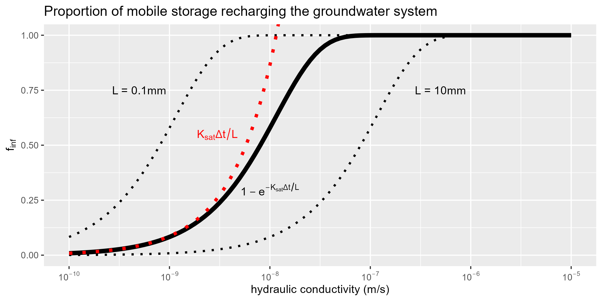

The so-called explicit soil moisture accounting (SMA---Todini and Wallis, 1977; O'Connell, 1991) algorithm is used to compute the water balance, and here it is intentionally simplified. 

### Vertical integration

Where this conceptualization differs from typical SMA schemes is that here there is no distinction made among a variety of storage reservoirs commonly conceptualized in established models. For example, all of interception storage, depression storage and soil storage (i.e., soil moisture below field capacity) is assumed representative by a single aggregate store, thus reducing model parameterization. This conceptualization is allowed by the fact that this model is intended for regional-scale application $(\gg1000\text{ km²})$ at a high spatial resolution $(\text{i.e., }50\times 50\text{ m² cells})$. Users must consider the results of the model from a "*bird's-eye view*," where water retained at surface is indistinguishable from the many stores typically conceptualized in hydrological models. 

The SMA's overall water balance is simply:

$$
	\Delta S = P-E-R-G,
$$

where $\Delta S$ is the change in (moisture) storage, $P$ is "active" precipitation (which includes direct inputs rainfall $+$ snowmelt and indirect inputs such as runoff originating from upslope areas), which is the source of water to the grid cell. $E$ is total evaporation (transpiration $+$ evaporation from soil and interception stores), $G$ is *net* groundwater recharge (meaning $G<0$ accounts for groundwater discharge), $R$ is excess water that is allowed to translate laterally (runoff). All of $E$, $R$, and $G$ are dependent on moisture storage $(S)$ and $S_\text{max}$: the water storage capacity of the grid cell. Both $E$ and $G$ have functional relationships to $S$ and $S_\text{max}$, and are dependent on other variables, whereas $R$ only occurs when there is excess water remaining $(\text{i.e., }S>S_\text{max})$, strictly speaking:

<!-- $$ \Delta S = P-\left(E+G\right)\propto f\left(S,S_\text{max}\right)-R|_{S>S_\text{max}} $$ -->

<!-- $$
    \Delta S = \underbrace{P}_{\substack{\text{sources}}}
        - \underbrace{f\left(E_a,K_\text{sat},S,S_\text{max}\right)}_{\text{sinks}}
        - \underbrace{R|_{S>S_\text{max}}}_{\text{excess}}
$$ -->

$$
    \Delta S = \underbrace{Y_a+B}_{\substack{\text{sources}}}
        - \underbrace{f\left(E_a,K_\text{sat},S,S_\text{max}\right)}_{\text{sinks}}
        - \underbrace{R|_{S>S_\text{max}}}_{\text{excess}}
$$

[*see glossary*](/interpolants/glossary.html)

# SMA Reservoirs

Every model cell consists of a retention reservoir $S$ (where water is held locally that has the potential to drain but is still considered "mobile" in that if conditions are met, lateral movement would occur). The reservoir has a predefined capacity and susceptible to evaporation loss. In addition, any number of cells can be grouped which share a semi-infinite conceptual groundwater store $(S_g)$.

Although conceptual, storage capacities are related to common hydrological concepts, for instance:

$$ S_\text{max}=\theta_\text{fc} z_\text{ext}+F_\text{imp} h_\text{dep}+F_\text{can} h_\text{can}\cdot\text{LAI} $$

where $\phi$ and $\theta_\text{fc}$ are the water contents at saturation (porosity) and field capacity, respectively; $F_\text{imp}$ and $F_\text{can}$ are the fractional cell coverage of impervious area and tree canopy, respectively; $h_\text{dep}$ and $h_\text{can}$ are the capacities of impervious depression and interception stores, respectively; $\text{LAI}$ is the leaf area index and $z_\text{ext}$ is the extinction depth (i.e., the depth of which evaporative loss becomes negligible). Change in storage at any cell at any time is defined by:

$$ \Delta S=y_a+k_\text{in}+b-\left(a+g+k_\text{out}\right), $$

where $y_a$ is atmospheric yield (rainfall + snowmelt), $k = q\frac{\Delta t}{w}$ is the volumetric discharge in $(\_\text{in})$ and out $(\_\text{out})$ of the grid cell and $f_k$ is the volume of mobile storage infiltrating the soil zone; all units are [m]. (Note that groundwater discharge to streams---$b$---only occurs at stream cells and is only a gaining term.) Also note that $k_\text{out}$ only occurs when water stored in $S_k$ exceeds its capacity.

## Groundwater recharge

<!-- Groundwater recharge at any given cell is computed when there is surface water in excess $(S^+=S-S_\text{max}>0)$: -->

<!-- $$ g=S^+\left[1-\exp\left(\frac{-K_\text{sat}}{L}\Delta t\right)\right]. $$ -->

Groundwater recharge at any given cell is computed when there is surface water held in storage:

$$ g=S\left[1-\exp\left(\frac{-K_\text{sat}}{L}\Delta t\right)\right]\cdot\left(1-F_\text{imp}\right). $$

This groundwater recharge equation is designed to control so-called _**"cascade towers"**_ which occur when confluences in the [cascade network](/interpolants/modelling/waterbudget/overlandflow.html#cascade-network) create unrealistically high stages. (This is mainly a consequence of the simplicity of the overland flow scheme applied here---normally, the [pressure term](/info/lia/#conservation-of-momentum) in the shallow water equations provides this control physically.)

 

*Visual interpretation of the above function. Characteristic length $L$ can clearly be used as a scaling factor, showing here how it varies around $L=1\text{ mm}$. $(\Delta t=86400 \text{ sec}.)$*

<!-- *Visual interpretation of the above function. Characteristic length $L$ can clearly be used as a scaling factor, showing here how it varies from $L=1\text{ mm}$. $(\Delta t=21600 \text{ sec}.)$* -->