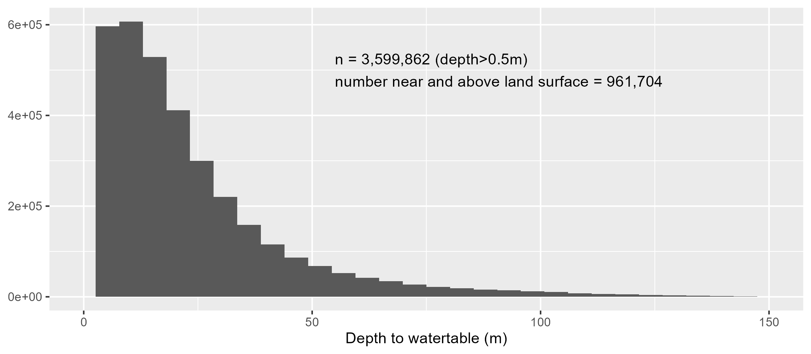

> A regionally-distributed runoff/recharge model has been developed to simulate regional-scale (40k km²) integrated groundwater/surface water processes at a fine (60m grid) resolution. The model code is written in an attempt to simulate large-scale/high resolution distributed hydrological phenomena while remaining amenable to multi-threaded computer architectures. No process of the model is in any way novel, rather a suite of existing model structures have been chosen and coded to minimize model run times, while maintaining an ease of implementation, practical applicability and scalability.

<iframe src="https://golang.oakridgeswater.ca/pages/OWRC23WB.html" width="100%" height="400" scrolling="no" allowfullscreen></iframe>

_Sample outputs (mm/yr) from the water budget model (v.2405)_

 

# Executive Summary

- Integrated groundwater surface water numerical model.
- Built for fast computation.
- 12.4M x 60x60 m cells x 6-hourly time-step x >20 years.
- Simulates evaporation, runoff, infiltration, watertable elevations, groundwater discharge and recharge occurring in response to a rainfall and/or snowmelt events.
- Model simulates from the hydrological water year 2003 (Oct 10, 2002).
- Runs on regional climate data-fields:
    - ECCC Precipitation collected from [CaPA-HRDPA](https://eccc-msc.github.io/open-data/msc-data/nwp_hrdpa/readme_hrdpa_en/).
    - NOAA Snowmelt collected from [SNODAS](https://nsidc.org/data/g02158/versions/1).
    - Air temperature $(T_a)$, relative humidity $(r)$ and windspeed $(u)$ interpolated from [MSC](http://climate.weather.gc.ca/historical_data/search_historic_data_e.html).
    - Potential evaporation $(E_a)$ determined using the [empirical wind functions of Penman (1948)](/interpolants/modelling/waterbudget/data.html#atmospheric-demand-e_a).
- Explicit soil moisture accounting (SMA) scheme.
- Cold content energy balance snowpack model when SNODAS was unavailable (pre-2010).
- Distribution function based shallow groundwater model with groundwater feedback mechanisms (e.g., saturation-excess runoff).
- Steepest-decent cascade overland flow routing.

 

**Contents**

* TOC
{:toc}

# Introduction
The following is a description of the regionally-distributed runoff/recharge model, an experimental water budget tool hosted on [our web-mapping platform](https://maps.oakridgeswater.ca/Html5Viewer/index.html?viewer=ORMGPP), hereinafter referred to in its entirety as the "*model*".

The model's primary intention is to project land surface moisture distribution for the purposes of estimating regional groundwater-surface water interactions, namely groundwater recharge and discharge. It utilizes hydrological model procedures that are amenable to data availability local to southern Ontario Canada. While the model can simulate stream flow discharge and overland runoff at any point in space, the model is not intended for rainfall runoff modelling and flow forecasting; outputs from this model will be used to constrain regional groundwater models within the Oak Ridges Moraine Groundwater Program jurisdiction. Mean daily streamflow and shallow groundwater monitoring at 100s of locations remain the primary calibration target.

This model is currently deemed experimental, and its use for practical application should proceed with caution. Users should be aware that model results posted online will always be subject to change. Ultimately, the intent of this model is to produced ranges of long-term (monthly average) water budget metrics (precipitation, runoff, evaporation, net recharge, moisture state, etc.) as a hydrological *reference* for the [partners of the ORMGP](https://www.oakridgeswater.ca/). This reference is maintained in real-time, updated by the ORMGP [Near Real-time Climate Data Service](/interpolants/sources/climate-data-service.html).

The model is physically based in that mass is conserved and processes are not constrained to any particular time-step. The model conceptualization has maintained parameters that speaks to the common physical hydrology lexicon, with parameters such as percent impervious, soil conductivity, extinction depth, depression storage, etc. The model is a hydrological model integrated with a TOPMODEL-inspired conceptual groundwater system. The source code is [open and free to use](https://github.com/maseology/rdrr). Below is the description of the model procedures that have been codified.

## The Pragmatic Model Design Philosophy

The model is deemed an *integrated* groundwater/surface water model although its build differs from most integrated models used in practice. With current technology, to arrive at an estimate of the distribution of groundwater recharge, modellers must choose between standard rainfall-runoff hydrologic models that neglect the role of groundwater feedback mechanisms (e.g., high water tables limiting the capacity of recharge rates) or move toward integrated groundwater/surface water models with their complicated data input and their *long* run times.

Here, a pragmatic approach to recharge model design is followed to maintain an explicit representation of the shallow groundwater system, while maximizing computational performance. The proposed model design allows for uncertainty analysis to be readily performed on a large-scale model domain (>10,000 km²) at a fine spatial distribution (<hectare grid cells) and temporal scale (<daily time-steps).

The proposed model incorporates a systematic framework with a diverse range of common hydrologic procedures, concurrent code selection, topological sorting of distributed environmental processes and an optimized IO strategy. Altogether, the model rivals the quick performance of rainfall-runoff models while still providing comparable groundwater-surface water interactions obtained using computationally expensive integrated models. (For more information on model benchmarking can be explored [here](/interpolants/modelling/waterbudget/benchmarking.html).)

> Today, as we modellers come to the realization that Moore’s Law is not panning out, the models we apply in decision-making, and the due diligence we maintain investigating our models' uncertainty, ultimately require pragmatism in their design. 

# Codification

Model performance has been maximized in three ways:

1. Code selection \
    The model is written in [**_Go_**](https://go.dev/), an open source, free, cross-platform, self-dependent language. The Go language is inherently *concurrent*, meaning that creating models that optimize computer resources (i.e., scalable) can be implemented with ease.

1. Queuing and Topology \
    Conceptually, the model relies heavily on inferred causal relationships, such as *runoff from a particular location moves in a downhill direction, where it may infiltrate and cease being runoff at any particular downslope location*. From these relationships, the causal (downhill) ordering of runoff processes is realized. This order is the model's topology and gives rise to performance gains like recursive algorithms and concurrent queuing/load balancing.

1. Procedural selection (hydrological process simulation) \
    Having a concurrent language alone isn't enough, rather it is hydrological processes that have been selected and coded into numerical procedures. Probably the biggest limitation to this model is the strict avoidance of any numerical procedure that can't be solved analytically.

The model represents a computational part of the ORMGP's *data assimilation system* (DAS), meaning it's not intended to be a predictive tool, rather a means to gain spatially distributed information (runoff, recharge etc.) from readily available data. Ultimately the goal is to have at near-realtime, distributed hydro-climatological data, at sub-daily time-steps that includes estimates of:
- precipitation (rainfall and snowfall)
- atmospheric states (temperature, humidity, pressure, and wind)
- snowmelt
- total evaporation
- soil moisture
- infiltration
- runoff
- groundwater recharge, and
- groundwater discharge

These variables/states are calculated every 6 hours, to 12.4M model cells (on a 60 $\times$ 60 m² grid). Variables can be outputted at daily, monthly, seasonal, annual, or long-term average time-scales; at the original 60m grid or aggregated to >4,000 10km² sub-watersheds.

### Parsimony

The underlying premise to this model design is that topography and the presence of a shallow water table is the principle determinant of runoff generation (in southern Ontario). The models conceptualization has been built to counter common conceptualization, such as:

1. Common rainfall-runoff models tend to coarsen the landscape by lumping areas into representative units. Ultimately this requires additional processes to effectively reproduce the rainfall-runoff phenomenon. The most accurate data we have as hydrological modellers is the digital elevation model and yet, these data are constantly under-utilized.
1. Common rainfall-runoff models tend to neglect the role of the groundwater system. In southern Ontario, more than a quarter of the landscape has water table depths within 50cm of surface:

*Distribution of water table depths greater than 0.5m in the ORMGP region. Water table is [interpolated from known depths](/watertable/). Consider also that [the water table is shone to vary ±0.7m](/snapshots/md/gwvar.html).*

 

Consequently, by countering common practice many common hydrological procedures have been deemed unessessary--enabling the model parameterization to be relatively parsimonious--these include:

1. **No Hortonian runoff**: with an explicit treatment of the groundwater system, runoff generation is dependent on the saturation-excess (Dunnian) mechanism only.
1. **No hierarchy in water stores**: this model follow a top-down philosophy. Water stores are aggregated as we focus on simply the spatial distribution of land surface moisture only. This eliminates the need to model interception storage, transpiration, etc.

> It must be stated that we fully appreciate that rainfall-runoff modelling most commonly used in engineering practice can safely neglect the water table and topography. For our purposes, _**we are in the need for an estimate of groundwater-surface water interactions and the rates and locations of groundwater recharge**_ and experience has shown that this interface must be explicitly accounted for.

# Theory

Theory of the regionally-distributed runoff/recharge model can broken up into three main components:

### [Shallow groundwater](/interpolants/modelling/waterbudget/gw.html)

<!-- $$ \zeta=\ln\frac{a}{T_o\tan\beta} $$ -->

$$ \zeta=\ln\frac{a}{T_oS_0} $$

### [Land surface soil moisture accounting](/interpolants/modelling/waterbudget/sma.html)

$$ \Delta S=P-E-R-G $$

### [Overland flow routing](/interpolants/modelling/waterbudget/overlandflow.html)

<!-- $$ F_\text{casc}=1-\exp\left(\frac{\tan^2\beta}{-\alpha}\right) $$ -->

<!-- $$ F_\text{casc}=1-\exp\left(\frac{S_0^2}{-\alpha}\right) $$ -->

$$ F_\text{casc}=f(\sqrt{S_0}) $$

# Input Data

## Meteorological Forcings

Meteorological forcing represents how the weather affects sea the rainfall-runoff-recharge phenomenon.  These include to varying degree: precipitation, air temperature, air pressure, relative humidity, wind speed, solar radiation, etc. Many hydrological models accept a variety of these forcing data, depending on the processes the model code (and sometimes the modeller) chooses to implement.

### IO strategy

To make the most of computational efficiency, many processes that are typically computed as part of an *off-the-shelf* hydrological model have here been pre-processed as an input to the ORMGP water balance model and post-processed from model output. These pre-/post-processing steps are made independent of the core model code by strategically designing the model's inputs and outputs *(IO)*, thereby making computational gains.  For instance, meteorological forcings such as snowmelt and potential evapotranspiration can modelled independently prior to the rainfall-runoff-recharge process. 

> A top-down approach

The model considers the greater role the atmosphere has on the ORMGP region. The *Planetary Boundary Layer* (Oke, 1987) is conceptualized as the barrier from which mass must transfer when surface evaporation is captured by the atmosphere and when liquid water originating from the atmosphere is released onto the land surface. 

The model input ("meteorological forcing") data are provided on a 6-hourly timestep. These data have been distributed to [some 4,200 10km² sub-watersheds](https://owrc.github.io/interpolants/interpolation/subwatershed.html). They reflect the sources and sinks, respectively, of liquid (read: mobile) water on the land surface.

The aim of the model design is to simultaneously reduce the amount of computational processes and leverage near-real-time data assimilation products. So, it is first recognized from a hydrological model design perspective, that the primary driver of watershed moisture distribution is the *"Atmospheric Yield"*, that is, water sourced from the atmosphere in its liquid/mobile form:

$$\text{Atmospheric Yield} = \text{Rainfall} + \text{Snowmelt}$$

In a similar sense, the "atmosphere" (specifically the Planetary Boundary Layer of Oke, 1987) also has a drying power, a sink termed *"Atmospheric Demand"*. 

It is matter of perspective that dictates the terminology here. The model was designed from a *top-down* viewpoint. Terms like "potential evaporation", which speaks to the evaporation occurring on a surface with unlimited water supply, is instead termed "atmospheric demand", that is the capacity for the atmosphere to remove moisture from a rough land surface.

Snowmelt, rainfall and evaporation are not readily available in a distributed form and need to be determined/interpolated. The model is integrated with [the ORMGP-FEWS data management platform](/interpolants/fews/). Below is an interactive map of the meteorological forcing distribution used in the model. Total model coverage ~40,000 km².

 

`click on sub-watershed for more info`

<iframe src="https://golang.oakridgeswater.ca/pages/swsmet.html" target="_blank" width="100%" height="400" scrolling="no" allowfullscreen></iframe>

*Note: sub-watersheds shown above each consists of roughly 3,000 60x60m model grid cells*

 

Finally, the model was designed to remain amenable to data availability and new technologies int the ORMGP jurisdiction.  For instance, [SNODAS](https://nsidc.org/data/g02158) can avoid the need to model snowmelt explicitly (saving on run-times); [CaPA-HRDPA](https://eccc-msc.github.io/open-data/msc-data/nwp_hrdpa/readme_hrdpa_en/) eliminates the (undesirable) need to spatially interpolate station-based precipitation.

### Data sources, transformations and pre-processing

In the **[Data sources, transformations and pre-processing](/interpolants/modelling/waterbudget/data.html)** section, all of the source data, how they're distributed over the ORMGP jurisdiction and how they're scaled both spatially and temporally are described. (For more aid, refer to the [*glossary*](/interpolants/glossary.html).)  In the end, all climate data are reduced to two meteorological *forcing* data used as input to the model:

* **[Atmospheric Demand $(E_a)$](/interpolants/modelling/waterbudget/data.html#atmospheric-demand-e_a)** is the "drying power" of the near-surface atmosphere, also known as the Planetary Boundary Layer (PBL­­­­-­­­Oke, 1987); and
* **[Atmospheric Yield $(Y_a)$](/interpolants/modelling/waterbudget/data.html#atmospheric-yield-y_a)** is water in its liquid/mobile form released either as rainfall or snowmelt onto the land surface.
<!-- * **[Snowmelt $(P_M)$](/interpolants/modelling/waterbudget/data.html#sub-daily-from-daily-snowmelt)** -->

### Model Variables

One goal for the model design was to leverage contemporary gridded data sets available from a variety of open and public sources. Products known as "*data re-analysis products*" or "*data-assimilation products*" attempt to merge meteorological information from a variety of sources, whether they be ground (station) measurements, remote sensing observations (e.g., radar, satellite, etc.), and archived near-cast weather model outputs.  When combined, the gridded data resemble the spatial distribution of meteorological forcings unlike what can be accomplished through standard interpolation practices using point measurements (e.g., thiessen polygons, inverse distance weighting, etc.).

An advantage to the data-assimilation products is that they remove the modeller from needing to model certain processes explicitly. For example, the model does not account for a snowpack, rather inputs to the model include snowmelt derived from SNODAS.

The extent of the model combined with the resolution of the processes simulated lends itself best viewed from a top-down perspective (Sivapalan et.al., 2003). This allows for model simplification by which many of the layered water stores (i.e., interception, depression, soil, etc.) may be handled procedurally as one unit. Viewing the model domain in its 40,000 km² extents, one can imagine how difficult it would be to discern any vertical detail.

## Physical Constraints

Physical constraints speak to how the model domain is structured spatially, meaning that these constraints (generally) do not change over time. Things like elevation and topography, land use and soil types make up the constraints that that ultimately translate to watershed hydrology.

### Digital Elevation Model

The [Provincial Digital Elevation Model](https://geohub.lio.gov.on.ca/maps/mnrf::provincial-digital-elevation-model-pdem/about) (PDEM--OMNRF, 2019) was re-sampled to the model's 60 x 60 m grid cell resolution. Surface depressions were removed using Wang and Liu (2006) and flat regions were corrected using Garbrecht and Martz (1997).

Drainage directions and flow-paths of the now hydrologically correct DEM were were assigned based on the direction of steepest decent (D8). Cell gradients ($b$) and slope aspects were calculated based on a 9-cell planar interpolation routine. The unit contributing area $a=A/w$ topographic wetness index $ln\frac{a}{\tan\beta}$ (Beven and Kirkby, 1979) were computed for every cell.

### Sub-basins

The 40,000 km² model area has been sub divided into [4,238 approximately 10 km² sub-basins](/interpolants/interpolation/subwatershed.html). Within these sub-basins meteorological forcings from external sources are aggregated and applied uniformly within the sub-basin (via a pre-processing routine).

The sub-basins are *topologically connected* meaning that encoded among each basins is the knowledge of both the upstream basins it receives drainage from and the downstream basin it drains to.

 

<iframe src="https://owrc.shinyapps.io/sws23/" width="100%" height="400" scrolling="no" allowfullscreen></iframe>

*Layout of the 4,238 sub-basins, each about 10 km² in size. Clicking on any basin will show the upstream basins in green (i.e., the catchment area) and the downstream basins in red. This map can also be [opened in separate tab.](https://owrc.shinyapps.io/sws23/)*

 

### Land use and Surficial geology

An overlay analysis is the process of overlaying 2 or more spatial layers and capturing statistics associated with their relative coverage. In this case, the sub-watershed layer is overlain by Provincial land-use and surficial geology layers to obtain information like percent impervious, relative permeability, etc.

Provincial layers discussed in more detail below have in all cases been re-sampled to the 60x60m² grid associated with the [hydrologically corrected DEM](/interpolants/interpolation/overland.html). It is from these rasters where the aggregation of watershed characteristics is computed.

- [Land use](/interpolants/interpolation/landuse.html): Southern Ontario Land Resource Information System (SOLRIS) Version 3.0 Landuse. [*metadata*](/metadata/surfaces/land_use.html).
- [Surficial geology](/interpolants/interpolation/surfgeo.html): OGS (2010) Surficial geology of southern Ontario. [*metadata*](/metadata/surfaces/surficial_geology.html).

Downscaling of the above layers is based on the dominant land use/surficial geology class (by area) assigned within every 60x60m² grid cell. 

#### Impervious and Canopy coverage

Using a look-up system, the set of raster cells contained within every 60x60m² grid cell are assigned a value of imperviousness, water body, wetland and canopy coverage (according to their SOLRIS index) and accumulated to grid cell sum.

*Percent impervious and canopy coverage as per SOLRIS v3.0 (MNRF, 2019) land use classification.*

| SOLRIS index | Name | Imperviousness (%) | Canopy cover (%) |
|---|---|---:|---:|
| 23 | Treed Sand Dune | | 50 |
| 43 | Treed Cliff and Talus | | 50 |
| 52 | Shrub Alvar | | 25 |
| 53 | Treed Alvar | | 50 |
| 65 | Sparse Treed | | 40 |
| 81 | Open Tallgrass Prairie | | 10 |
| 82 | Tallgrass Savannah | | 35 |
| 83 | Tallgrass Woodland | | 85 |
| 90 | Forest | | 100 |
| 91 | Coniferous Forest | | 100 |
| 92 | Mixed Forest | | 100 |
| 93 | Deciduous Forest | | 100 |
| 131 | Treed Swamp | | 50 |
| 135 | Thicket Swamp | | 50 |
| 140 | Fen | | 25 |
| 150 | Bog | | 25 |
| 160 | Marsh | | 25 |
| 191 | Plantations -- Tree Cultivated | | 85 |
| 192 | Hedge Rows | | 85 |
| 201 | Transportation | 85 | |
| 202 | Built-Up Area -- Pervious | 10 | 10 |
| 203 | Built-Up Area -- Impervious | 90 |  |
| 205 | Extraction -- Peat/Topsoil | | 10 |
|  | **All else** | **0** | **0** |	

 

#### Land use sub-categorization

Land used are also grouped according to a surface type and a canopy type. This was done to reduce the number of distinct land use types into a set of types with similar hydological function.

##### Surface Type

The surface type is mainly used to parametrize surficial storage, including depression storage and shallow soil zone storage that is base on soil zone depth, porosity, and water retention (i.e., field capacity).

| Surface Type | notes |
|---|---|
| No flow | lands where runoff does not occur |
| Urban |  |
| Agriculture |  |
| Barren |  |
| Sparse Vegetation |  |
| Dense Vegetation |  |
| Short Vegetation  | mainly trees |
| Tall Vegetation | mainly grass |
| Forest |  |
| Meadow |  |
| Wetland |  |
| Swamp |  |
| Marsh |  |
| Channel | natural, streams |
| Waterbody | small/isolated |
| Lake |  |

##### Canopy Type

Next, canopy type dictate how canopy cover affects water storage, such as leaf-are-index (LAI) and interception storage.

| Canopy Type | notes |
|---|---|
| Open | no canopy |
| Shrub |  |
| Coniferous |  |
| Deciduous | seasonal coverage |
| Mixed Vegetation |  |

 

#### Permeability

The OGS classes have been grouped according to the attribute "permeability" using a similar look-up table cross-referencing scheme. OGS (2010) adds: *"Permeability classification is a very generalized one, based purely on characteristics of material types."*  Each classification is assigned an "effective" hydraulic conductivity listed below. 

> For reference, 1e-8 m/s = 316 mm/yr.

*Permeability classifications (after OGS, 2010) and assumed effective hydraulic conductivities.*

| OGS classification | K (m/s) |
|---|---|
| Low | 1e-09 |
| Low-medium | 1e-08 |
| Medium | 1e-07 |
| Medium-high | 1e-06 |
| high | 1e-05 |
| unknown/variable | 1e-08 |
| fluvial | 1e-05 |
| organics | 1e-06  |
| Bedrock with drift&#8224; |  1e-09 |
| Impermeable&#8224; | -- |

*&#8224; Bedrock and Impermeable have been added and are not part of the OGS classification scheme.*

 

Additional processing includes aggregating the "effective" hydraulic conductivities to each sub-watershed by taking the the geometric mean of every 60x60m² grid cell contained within each sub-watershed. The resulting effective hydraulic conductivity is then mapped back to the nearest Low–High OGS (2010) classification.

#### Processing source code
Processing discussed above that are operational have been documented in a [jupyter notebook](https://github.com/OWRC/interpolants/blob/main/interpolation/calc/landuse/OWRC23-lusg.ipynb). Source data needed to build the derivative surfaces can be found [here](https://www.dropbox.com/scl/fo/bfkxkkrz940eqkdsk9cqy/AJadVHg9De-SdPWFORDCIHE?rlkey=tndynpc63rclqc8tu527cxg0d&e=1&dl=0) and resulting outputs can be found [here](https://github.com/OWRC/interpolants/tree/main/interpolation/calc/landuse/output).

 

<iframe src="https://golang.oakridgeswater.ca/pages/sws-characterization.html" width="100%" height="400" scrolling="no" allowfullscreen></iframe>

*Distribution of land use and surficial geology properties aggregated by sub-watershed.*

 

# Model Structure

### Computational Elements
Model grids in the model represent a homogenized area on the land surface, similar to the concept of a Hydrologic Response Unit (HRU). The term HRU will be avoided here as the concept itself is not well defined and simply *"model cell"* or *"cell"* will be used herein to avoid ambiguity. All processes within the cell are assumed to represent the "average" condition within the grid cell. The spatial proximity of each cell is maintained, meaning that runoff occurring from an up-gradient cell will "runon" to an adjacent down-gradient cell to preserve the spatial distribution of land surface moisture.

### Time-stepping

The model runs on a 6-hourly basis in order to capture hydrological dependence on the diurnal fluctuation of energy flux at the ground surface.

The time step of the model has been set to 6-hour steps on 00:00 UTC, yielding the local time steps of 01:00, 07:00, 13:00, and 19:00 EST. This step is chosen as it matches the received precipitation dataset described above.

### Model Domain
The model code employs an object called the "Model Domain", where all necessary model data are digitized and self-contained, including:

1. `Structure` holds all the geometrical and topological information at every grid cell, including the physical dimensions of cells (e.g., cell slope) and knowledge of where runoff is to be routed, upslope contributing area.
1. `Mapper` contains a *cell-to-type* cross-reference mapping to distribute model parameters, such as percolation rates, soil zone depth, depression storage, etc. The Mapper *projects* parameter selection onto the grid space domain based on their local (an often unique) land use type and surface material.
1. `Subwatershed` references cells grouped as sub-watersheds and provides the model with optimal order of downstream processing.
1. `Parameters`: Parameter collections for a set of [land-surface](/interpolants/interpolation/landuse.html), [surficial geology](/interpolants/interpolation/surfgeo.html) and groundwater reservoir types that are mapped using the `Mapper` object.
1. `Forcings`: Input (variable) data, generally meteorological forcings: $Y_a$ and $E_a$.

# Parameterization

The model's structure is defined by at least 5 raster data sets. The model's input data pre-processor will generate additional information based on these data:

1. digital elevation model
1. land use index (with parameter lookup table)
1. surficial geology index (with parameter lookup table)
1. groundwater zones

The procedures applied at the cell scale are quite parsimonious. There is no separate treatment of interception, depression storage, nor soil water retention, rather it is assumed that these processes respond to environmental factors (e.g., evaporation) concurrently and thus treated as one.

From the top-down perspective, viewing some 12.4 million 60 x 60 m cells covering over 40,000 km², it seems rather overcomplicated to account water any more than to total mass present at any particular location.

### Runoff

Land area that has the capacity to retain water (through interception, soil retention, depression/rill storage, etc.) must be satisfied before runoff is generated.

Runoff is conceptualized as being generated through the saturation excess (Dunne, 1975 CHECK) mechanism. The saturation excess mechanism is dependent on topography and its interaction with the water table. The model is distributed with an integrated (albeit conceptual) groundwater system.

Surface water-groundwater integration is viewed from the hydrologists' perspective: areas where the groundwater system is limiting infiltration (shallow groundwater table) and even contributing to overland runoff (springs/seepage areas). As a model output, this can be quantified as a net groundwater exchange field (groundwater recharge less discharge)

The basis of the model is that topography is paramount to the lateral movement of water that yields runoff. The model is deemed regional in that it covers a large areal extent, yet is kept to a fine resolution to ensure that observed geomorphic flow patterns are represented in the model.

### Pre-defined data-driven parameters

The following are determined using a topographical analysis:

- $S_0$: slope of a model grid cell [m/m]
- $\delta D_i$: relative saturation ([see more](/interpolants/modelling/waterbudget/gw.html)) [m]
- $F_\text{casc}$: cascade fractions are based on a pre-determined relationship with local gradients [-]

### Globally applied parameters

Cells with a contributing area greater than 1 km² are deemed "stream cells" in which additional sources include groundwater discharge to streams.

<!-- - $D_\text{inc}$: depth of incised channel relative to cell elevation [m] (note, while it is possible to assign this parameter on a cell basis, it was treated here as a global "tuning" parameter.) [m] -->
- $\Omega$: channel sinuosity [-]
- $\alpha$: scaling parameter for determining $F_\text{casc}$

### Regional groundwater parameters

Groundwater processes in the model are conceptualized at the sub-basin scale and so much of the groundwater parameterization is implemented here.

- $m$: TOPMODEL groundwater scaling factor [m]

### Land use based parameters

Each cell is classified according to (i) surficial geology and (ii) land use mapping where each class is parameterized independently. Look-up tables are used to distribute model parameters according to their classification.

- $F_\text{imp}$: fraction of impervious cover
- $F_\text{can}$: fraction of canopy cover

The following are used to compute the overall retention/storage capacity:
- $\phi$: porosity [-]
- $F_c$: field capacity [-]
- $d_\text{ext}$: extinction depth of soil, where evapotranspiration cease to occur [m]
- $E_\text{fact}$: evaporation factor for open-air surfaces [-]

<!-- - retention/storage capacity -->
<!-- - depression storage -->

### Surficial geology based

- $K_\text{sat}$: hydraulic conductivity as saturation (i.e., percolation rates) [m/s]

#### Checks
As part of the model pre-processor, the structural data and parameterization specified above is outputted as a set of raster for user inspection and troubleshooting. These raster are written as binary rasters _(*.bil)_ to a `check/` directory, prefixed by the model name and the [model domain component](#model-domain). Parameters include:

- `structure.cid`: grid cell ID ([row-major](https://en.wikipedia.org/wiki/Row-_and_column-major_order) ordered)
- `structure.aid`: ordered/topologically-sorted (zero-based) cell ID
- `structure.ads`: down-slope cell array index
- `structure.nus`: number of (upslope) cells contributing runoff to current cell
- `structure.upcnt`: count of upslope/contributing cells
- `structure.dwngrad`: downslope slope $(S_0)$
- `mapper.ilu`: land use index
- `mapper.isg`: surficial geology index
- `mapper.icov`: canopy cover type index
- `mapper.igw`: groundwater reservoir index
- `mapper.ksat`: vertical percolation/infiltration rates
- `mapper.fimp`: fraction of impervious cover
- `mapper.fint`: interception cover factor
- `sws.aid`: sub-watershed index (zero-based)
- `sws.sid`: sub-watershed index (original/user supplied)
<!-- - `sws.sgw`: groundwater index (only when groundwater reservoirs are not assigned by sub-watershed) -->
- `sws.dsws`: downslope sub-watershed index
- `sws.dcid`: receiving cell ID of downslope sub-watershed
- `sws.order`: computational sub-watershed ordering
- `parameter.gamma`: groundwater reservoir average soil-topographic index $(\gamma)$
- `parameter.zeta`: soil-topographic index $(\zeta)$
- `parameter.uca`: unit contributing area $(a)$
<!-- - `parameter.tanbeta`: surface slope $(S_0)$ -->
- `parameter.depsto`: depression storage

# Benchmarking

The intent of the model design was to build an integrated hydrologic model that was built for speed. The model is scalable, meaning that it is built to leverage computational resources of multi-threaded machines. As a simple expression of the model's ability to squeeze everything from the computer, here is a 12.4M cell model running at a 6-hourly time step on a 32 (virtual) core machine:

A specific page has been prepared comparing the [performance of the regionally-distributed runoff/recharge model](/interpolants/modelling/waterbudget/benchmarking.html) relative to a number of models of varying types. The model comparison performed here is not concerned with comparing model calibration, rather the raw performance (i.e., the time needed to run a model) of the selected model code.

<!-- # Calibration
* **[Model Parameters and Sampling](/interpolants/modelling/waterbudget/parameters.html)** -->

<!-- # Code
* **[Model Structure](/interpolants/modelling/waterbudget/structure.html)** -->

<!-- # Future plans
* **[Future plans](/interpolants/modelling/waterbudget/future.html)** -->

# Glossary

- masl - metres above sea level

- ECCC - Environment Canada and Climate Change

- atmospheric yield $(Y_a)$: term used to describe water (in liquid form) that is actively altering the hydrological state at a particular location.

# References

Beven, K.J. and M.J. Kirkby, 1979. A physically based variable contributing area model of basin hydrology. Hydrological Science Bulletin 24(1):43—69.

Garbrecht, J. and L.W. Martz 1997 The assignment of drainage direction over flat surfaces in raster digital elevation models

Oke, T.R., 1987. Boundary Layer Climates, 2nd ed. London: Methuen, Inc.

Ontario Geological Survey 2010. Surficial geology of southern Ontario; Ontario Geological Survey, Miscellaneous Release— Data 128 – Revised.

Ontario Ministry of Natural Resources and Forestry - Provincial Mapping Unit, 2019. Provincial Digital Elevation Model (PDEM).

Ontario Ministry of Natural Resources and Forestry, 2019. Southern Ontario Land Resource Information System (SOLRIS) Version 3.0: Data Specifications. Science and Research Branch, April 2019.

Sivapalan, M., L. Zhang, R. Vertessy, G. Blöschl, 2003. Downward approach to hydrological prediction, preface. Hydrol. Process. 17. pg. 2099. DOI: 10.1002/hyp.1426.

Wang, L., H. Liu, 2006. An efficient method for identifying and filling surface depressions in digital elevation models for hydrologic analysis and modelling. International Journal of Geographical Information Science 20(2): 193-213.