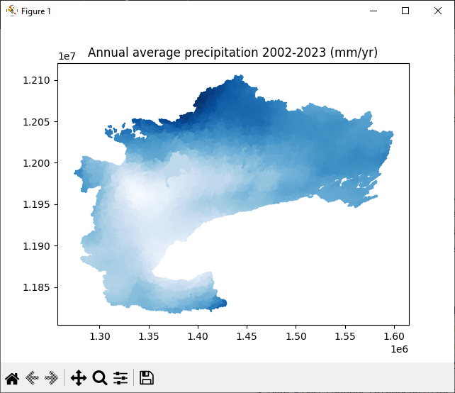

# NetCDF data extraction using Python 

[**Python**](https://www.python.org/) is a free and open source programming language that is fully capable of working with the [Near Real-time Climate Data Service](/interpolants/sources/climate-data-service.html) exported hard-copy files. Below, we're offering a sample python script used to extract the data, calculate total precipitation, compute annual averages and post them to the 4,238 delineated sub-watersheds.

## Data download

The data files required are first the sub-watershed where the climate data have been mapped:

> indexed sub-watershed polygons: [`PDEM-South-D2013-OWRC23-60-HC-sws10.shp`](https://www.dropbox.com/scl/fi/a0r65kr7i1jirdci6d8jg/PDEM-South-D2013-OWRC23-60-HC-sws10.7z?rlkey=caol95r7k0s9p1re31mlev2a4&dl=1)

and the NetCDF files that hold the data, either:

> the daily climatologies: [`OWRCdailyBasins2023.nc`](https://www.dropbox.com/scl/fi/059gqccwej6m791j9el9d/OWRCdailyBasins2023.nc?rlkey=8fe4dq61t5qqkmawinuoxxhzj&dl=1)

or

> the 6-hourly climatologies: [`OWRC6hourlyBasins2023.nc`](https://www.dropbox.com/scl/fi/coddz0za1zddtgv3utv4p/OWRC6hourlyBasins2023.nc?rlkey=65c0je8fg2dn4hr9g6yozt59k&dl=1)


## Python script

For the script, we'll be working with the 6-hourly data that are provided from 2002 to 2023. First, we need to load the requires packages:

```
import numpy as np
import shapefile as shp
import netCDF4 as nc
from functools import reduce
import matplotlib.pyplot as plt
import matplotlib.cm as cm
```

### Load data

Next, we'll load the sub-watershed shapefile:

```
sws = shp.Reader("PDEM-South-D2013-OWRC23-60-HC-sws10.shp")
```

Followed by the NetCDF file:

```
with nc.Dataset("OWRC6hourlyBasins2023.nc") as ds:
    ds.set_auto_mask(False) # https://github.com/Unidata/netcdf4-python/issues/785

    # time stamps
    tim = ds.variables['time'][:]

    # station IDs (need to convert the input character array to integer array)
    station_id = ds.variables['station_id'][:,:]
    station_id = np.int64(reduce(np.char.add, station_id.T)) 
    
    # Climate variables:
    pa = ds.variables['air_pressure'][:,:]
    ta = ds.variables['air_temperature'][:,:]
    rh = ds.variables['relative_humidity'][:,:]
    ws = ds.variables['wind_speed'][:,:]
    rf = ds.variables['rainfall_amount'][:,:]
    sf = ds.variables['snowfall_amount'][:,:]
    sm = ds.variables['surface_snow_melt_amount'][:,:]
    pe = ds.variables['water_potential_evaporation_amount'][:,:]
```

### Compute averages

Next, calculate mean precipitation (i.e., rainfall + snowfall) at every sub-watershed, covert to mm/yr:

```
vmean = np.mean(rf+sf, axis=0)*365.24*4
```

### Plot data

First, we convert the arrays to a dictionary with station_id as the lookup key, and normalized precipitation to the $[0,1]$ range:

```
vn, vx = np.min(vmean), np.max(vmean)
col = dict(zip(station_id, (vmean-vn)/(vx-vn)))
```

Lastly, using the 'Blues' colourmap, post the average precipitation values to every sub watershed and plot to a map

```
cmap = cm.Blues
plt.figure()
for shape in sws.shapeRecords():
    for i in range(len(shape.shape.parts)):
        cid = shape.record[0]
        v = col[cid]
        i0 = shape.shape.parts[i]
        if i==len(shape.shape.parts)-1: 
            i1 = len(shape.shape.points)
        else:
            i1 = shape.shape.parts[i+1]
        x = [i[0] for i in shape.shape.points[i0:i1]]
        y = [i[1] for i in shape.shape.points[i0:i1]]
        plt.fill(x, y, color=cmap(v))
plt.title("Annual average precipitation 2002-2023 (mm/yr)")
plt.show()
```

### Output

The resulting output:

