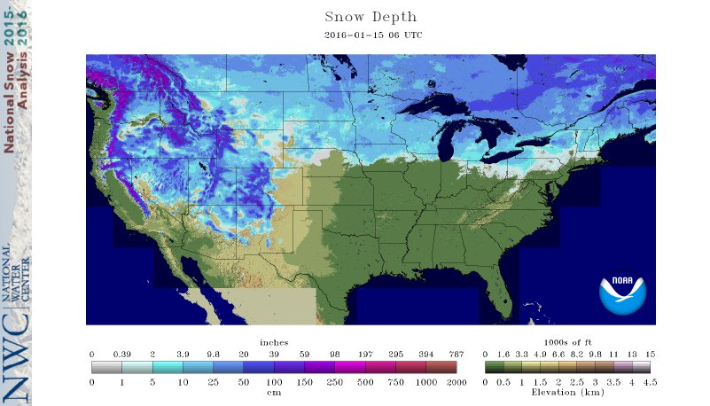

> The data source that are collected, interpolated and delivered through our web portal are described in chronological order. For the most part, the most recent datasets supersede the oldest.

* TOC
{:toc}

# **Precipitation, Rainfall and Snowfall**

## Meteorological Service of Canada

Meteorological Service of Canada is a division of Environment Canada. Their [online historical data portal](https://climate.weather.gc.ca/index_e.html) provides data collected since the mid 19th century. 
Precipitation is offered as rainfall and snowfall amounts to the tenth of a millimetre.

## ECCC: Regional Deterministic Precipitation Analysis (RDPA)

### Versions
Below lists the versions used, a complete [changelog can be found here](https://eccc-msc.github.io/open-data/msc-data/nwp_rdpa/changelog_rdpa_en/). The most recent version always takes precedence. 

#### CaPA-RDPA version 1—experimental (*2002—2012*)
The hind-cast "experimental" version 1 of CaPA-RDPA comes in a ~15km resolution.

#### CaPA-RDPA version version 2.4 (*2011—2016*)
Version 2.4 brings a number of improvements by incorporating more ground-truthing and refining to a ~10km resolution.

#### CaPA-RDPA version versions 4+ and 5+ (*2015—present*)
Further improvements, still at a ~10km resolution. 

#### CaPA-HRDPA (*2019—present*)
The latest iteration of CaPA is the [High Resolution Deterministic Precipitation Analysis (CaPA-HRDPA)](https://eccc-msc.github.io/open-data/msc-data/nwp_hrdpa/readme_hrdpa_en/) refined to a ~2.5km resolution.

### Missing Dates
The CaPA RDPA products used do have periods of no data. Listed below are the dates found. Where no data are found, the API reports the [data interpolated from MSC point locations](#meteorological-service-of-canada).

| CaPA-RDPA | CaPA-HRDPA |
| --- | --- |
| 2001-12-30 | 2019-12-14 |
| 2001-12-31 | 2019-12-15 |
| 2002-01-01 | 2019-12-16 |
| 2006-04-27 | 2019-12-17 |
| 2006-04-30 | 2021-01-01 |
| 2006-07-10 | 2022-01-01 |
| 2008-04-15 | 2022-06-20 |
| 2019-09-26 |            |
| 2019-09-27 |            |
| 2019-10-25 |            |
| 2020-03-16 |            |
| 2020-03-17 |            |
| 2020-04-21 |            |
| 2020-04-22 |            |
| 2020-10-01 |            |
| 2020-10-02 |            |

<!-- ### Missing Locations
At 2 locations, where the sub-watershed makes up the entirety of a small island, the Delft-FEWS interpolation scheme appears to overlook, and return a no-data value. When this occurs, the value given to nearby sub-watersheds are adopted. -->

# **Snowmelt and SWE**
## U.S. National Oceanic and Atmospheric Administration (NOAA) 
#### SNODAS daily (*2010—present*)
Snow water equivalent (SWE) and snowmelt must be derived from snowpack ablation models. These models come in a variety of forms and sophistication. The primary source of such information comes from the [Snow Data Assimilation System (SNODAS)](https://nsidc.org/data/g02158) system (NOHRSC, 2004), which offers ~1km gridded 24-hour (UTC 06-06) snowmelt totals, published freely in near real-time. The advantage of SNODAS is that we can avoid the need to model snowmelt explicitly, and leverage existing resources. The data cover our jurisdiction from 2009—present.

#### SNODAS 6-hourly (*2020—present*)
SNODAS is also offered in 6-hourly states, however offered only for the past month, so some automated web-scraping would be requires. Here, the [ORMGP-FEWS](/interpolants/fews/) system imports and crops the data nightly.

## Cold Content Energy Balance Snowpack Model
#### (*1901—present*)
When unavailable (and prior to 2010), a [cold content energy balance snowpack model](/interpolants/modelling/waterbudget/snowmeltCCF.html) is applied relying on interpolated precipitation and temperatures.

# **Air Temperature**

Elevations within the ORMGP region range from 75-400 masl and thus orographic effects to temperatures were deemed negligible. The spatial distribution of minimum/maximum daily temperature is then interpolated from meteorological stations using an inverse squared-distance methodology.

All temperature data are acquired from the Meteorological Service of Canada.

## Meteorological Service of Canada
#### Minimum and Maximum daily Temperature (*1901—present*)
#### Hourlies (*1953—present*)

# **Atmospheric Pressure**
## Meteorological Service of Canada
#### Hourlies (*1953—present*)
Atmospheric pressure data are acquired from Meteorological Service of Canada, which come in as hourly averages. In contrast to temperatures, [elevation does have am impact on pressure distribution and thus corrections are made](/interpolants/interpolation/barometry.html). Once corrected, the hourly data are then aggregated to daily averages.

# **Relative Humidity**
## Meteorological Service of Canada
#### Hourlies (*1953—present*)
Relative Humidity data are acquired from Meteorological Service of Canada

# **Wind Speed and Direction**
## Meteorological Service of Canada
#### Hourlies (*1953—present*)
Wind speed and direction data are acquired from Meteorological Service of Canada

# **Pan Evaporation**
## Meteorological Service of Canada
#### (*1962—1996*)
[*more info here*](/interpolants/interpolation/calc/panET/PanEvaporation.html)

<!-- # **Solar Irradiation** -->

