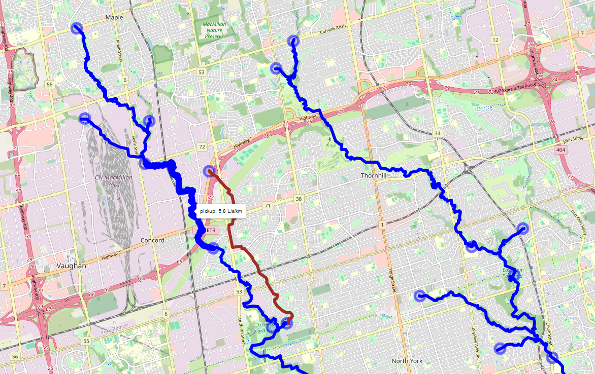
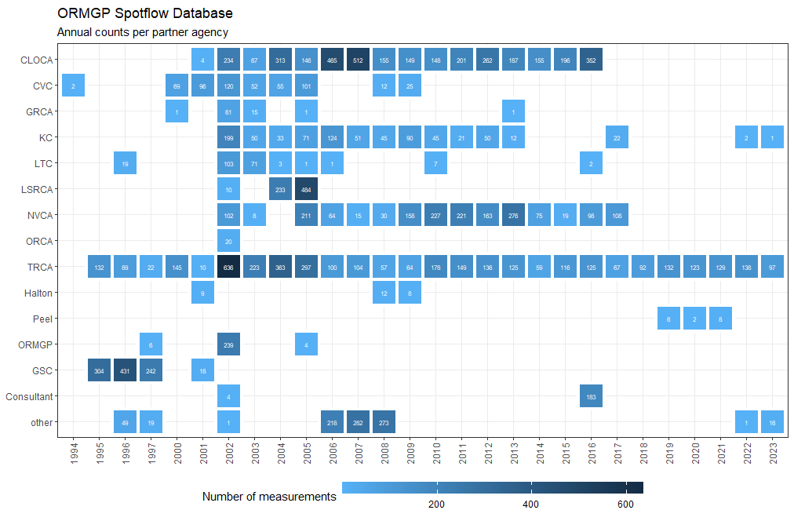
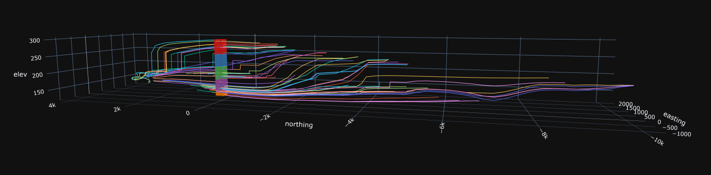

Tools

 

The following is an index of the tools maintained by the ORMGP. All data can be cited using the link below.

Contents

* TOC
{:toc}

 

# **Web Applications**

## Geocortex [Data Portal](https://maps.oakridgeswater.ca/Html5Viewer/index.html?viewer=ORMGPP)

The ORMGP Geocortex Mapping hub has been divided into various [_**Theme Maps**_](/webmapping/) to allow users to quickly hone in on the information they might be seeking. For example, the Documents Theme Map provides access to the program’s library of reports, The Boreholes Theme Map focuses on providing access to borehole specific information, and the Geology Theme Map provides access to all of the ORMGP geologically related mapping. The Theme Maps group specific related data sets or interpreted products ([more info here](/webmapping/)).

*Our current [web-mapping system](https://maps.oakridgeswater.ca/Html5Viewer/index.html?viewer=ORMGPP) relies on Geocortex*

### Geological layers

The [geological layers made available on the Geocortex portal](/interpolants/interpolation/geolayers.html) are found in two places: the Geology Theme Map and the [cross-section tool](#cross-section-tool). More information on [their interpreted depositional setting and of the procedures used to interpolate the surfaces](/GeoLayers/).

In the [Geology Theme Map](/webmapping/#geology-map), users can view either the tops of or the isopach/thickness of any of the layers.  The Geological Picks made at each well, that are used to construct or interpolate each layer are also available.  A screen capture from the website showing the Top of Halton Till as well as the picks is shown below.

*Screenshot of our Geocortex [web-mapping system](https://maps.oakridgeswater.ca/Html5Viewer/index.html?viewer=ORMGPP) showing geologic layers*

 

### Cross-section tool

The cross-section tool is designed to provide a cut, along a user-defined line, through the subsurface to display the regionally interpreted Quaternary [geological layers](#geological-layers) down to the bedrock. 

*Screenshot of our cross-section tool*

 

Included in the Cross-section tool (in addition to hydrostratigraphy):

- local boreholes from the ORMGP database
- [Watertable](/interpolants/interpolation#water-table-mapping)
- Top surface DEM ([*see metadata*](/metadata/external/mnr2006dem/LIO%20MNR%20DEM%2010m%20Metadata.pdf))

 

### Piper plots

The piper plot tool presents water chemistry in an informative way and can be sorted by location or geologic formation. Out piper plot tool take chemistry data in our database and creates the plots *on-the-fly*, for one or many locations.

*Screenshot of our database-generated piper plot*

 

### Spotflow Pickup

Spotflow surveys added to the ORMGP database are automatically hosted on our baseflow pickup API that translates spotflow measurements into a losing/gaining stream reach feature map. This is done by (algorithmically) coordinating surveyed spotflow locations to our [watercourse topology](/interpolants/interpolation#elevation-drainage-and-topology) layer. For example, any 2 spotflow measurements connected by any number of stream reaches will convert the baseflow discharges measured into a linear computation rates of gain/loss per unit kilometre of stream reach.

*Screenshot of our [(beta) spotflow pickup tool](https://owrc.shinyapps.io/pickup/). Blue features represent baseflow gains, while red are losses computed between spotflow measurements (circles). Hovering over reaches/point will reveal their values.*

 

*Summary of spotflow measurements shared amongst our partners.*

 

### Particle Tracking web-tool

The ORMGP particle tracking tool shows both the forward or backward particle tracking from a site that is being studied.  The tool is built upon [numerical models](/snapshots/md/numerical-model-custodianship-program.html) which have organized, synthesized and interpreted a wealth of hydrogeological information (e.g., boreholes, geological mapping, previous studies, etc.). 

* More info on 3D [**particle tracking** of the groundwater flow system and the methodology used in our web tool](/interpolants/modelling/particleTracking/).

*3D example of particles tracking within a 5-layer groundwater flow model--click on image to play with the interactive version*

 

### Clip 'n Ship
* ["Clip 'n Ship"](/interpolants/sources/clipnship.html) — A bulk spatial data export system, by geographic extent provided by a user and returned many of the products listed below clipped to within the specified extent.

 \
*Source: [ArcMAP Clip function](https://desktop.arcgis.com/en/arcmap/latest/tools/analysis-toolbox/clip.htm).*

 

## Shiny Hydrology  *(sHydrology)*
R-Shiny-Leaflet mapping with access to our monitoring dataset. [**Go to online map.**](https://owrc.shinyapps.io/shydrologymap/)

 

## Time-Series Analysis
* **R-Shiny apps**
   * [Help](/HydrographExplorerHelp/)
   * [Manual](/shinyapps-manual/)
* [Automatic hydrograph separation](/info/hydrographseparation/)
* [Hydrograph disaggregation](/info/hydrographdisaggregation/)

 

# **Numerical Modelling**

Numerical modelling at the ORMGP proceed in a number of ways: 

1. A long-term data assimilation system that uses hydrological analysis tools (i.e., models) and leverages the ORMGP's database. What amounts to a [*data assimilation system*](https://ldas.gsfc.nasa.gov/) (DAS), modelling technology is utilized to provide a real-time state of the hydrological system with the ORMGP jurisdiction, supported by the [data we manage](/interpolants/datamanagement/#data-sources). The computational structure of the DAS is specifically tailored to run as fast as possible, such that thousands of model "projections" made continuously on [ORMGP servers](/interpolants/datamanagement/#ormgp-servers). The results from these analyses are offered as monthly ranges in long term seasonal water balance estimates.
1. The ORMGP has been charge with maintaining over [100 existing numerical models](#numerical-model-custodianship-program) of varying types and purposes. We actively strive to ensure that these models are mainlined in an operational state, such that they can be readily shared with future modellers, thereby reducing the need for reproducing past work and maintaining past knowledge.
1. Outputs from select models maintained in our Numerical Model Custodianship Program are further processed to give our partners an interactive utility to the model's estimation of our regional flow system. For instance, users can readily visualize virtual [particle tracking](#particle-tracking-web-tool) to and from any location clicked within the model domain.
1. Other tools are intended for predictive use, but are restricted to short-term (say, less than 30 days) projections. The design of these models is more physically rigorous but will always be dependent on other models (e.g., existing groundwater models, the ORMGP DAS) to prescribe the antecedent conditions. While computational time for this model is orders of magnitudes greater than that of the DAS, it continuous to share the philosophy of designed whereby computation efficiency is paramount.

Combined, these two tools will provide all water groundwater resources needs for the ORMGP partners in order to:

1. utilize readily available datasets provided daily by government agencies of Canada and the United States without the need for [data pre-processing](/interpolants/modelling/waterbudget/data.html);
2. capture long-term hydrological water budget estimates with an emphasis on its certainty; and,
3. project near-term hydrological response given a known antecedent state.

 

## Numerical Model Custodianship Program

> Existing numerical model files, output and sharing

We have established a numerical modelling sharing process to assist consultants in moving forward on various projects by making use of previous interpretations/work.  The mission of the [**ORMGP numerical model custodianship program**](/snapshots/md/numerical-model-custodianship-program.html) is to provide numerical models to any consultant undertaking work within our partners' jurisdiction.  

Users (e.g., consultants) are expected to review the shared models' suitability to their intended application. Considering the age of the models, the expertise who constructed the model, the model's original intent, etc., it is the responsibility of the user to determine whether there is an approach more suitable than just using the model files as delivered. For instance, some consultants have only selected specific model file components (i.e., hydraulic conductivity distribution or geological layering, thicknesses etc.) to complete their task.

Users are free to update/modify the model in the hopes that the refinements are shared with the ORMGP in return for the sake of preserving knowledge.

Often, within any geographical area of a new/proposed consulting project, there are several models that could be used to aid the new project. Given the nature of the proposed project (e.g., water supply, contamination investigation, proposed land development, etc.) we may suggest the most appropriate model or the consultant is free to select any or all models, where available.  

The idea is that model sharing could perhaps reduce duplication of effort, thereby lowering consulting costs by providing previous modelling insights in a transferable digital format.  Given that every project is different, the likelihood that a model can be transferred to address the needs of a another study may be quite low.

  
* [Numerical Model Custodianship Program](/snapshots/md/numerical-model-custodianship-program.html) — model archive.
* [*A Guide for Actively Managing Watershed-Scale Numerical Models in Ontario*](https://www.oakridgeswater.ca/_files/ugd/4a0a6e_c41c71a481ea4657806e1fbb0c912f7a.pdf) — model management guidance (2017)

<iframe src="https://golang.oakridgeswater.ca/pages/numerical-model-custodianship-program.html" width="100%" height="400" scrolling="no" allowfullscreen></iframe>
_Set of numerical models maintained in the custodianship program_

 

## Regional Water Budget, Long-term and Continuous
* Fine-resolution (2,500 m²) [**Water Budgeting** using a  regionally-distributed runoff-recharge model](/interpolants/modelling/waterbudgetmodel.html) for Long-term (>20 years) continuos 6-hourly hydrological modelling of the ORMGP jurisdiction.
* Data sources for the water budget model are discussed [here](/interpolants/modelling/waterbudget/data.html).

## ORMGP Raven Model

In addition to the Water Budget model, the ORMGP hosts a semi-distributed rainfall runoff model built using the [**Raven hydrological modelling framework**](https://raven.uwaterloo.ca/). The model was initially developed to support the Water Budget (recharge) model in that it is built on the same [sub-watershed network](/interpolants/interpolation/subwatershed.html), [land-use](/interpolants/interpolation/landuse.html), [surficial geology](/interpolants/interpolation/surfgeo.html), [climate forcings](/interpolants/sources/climate-data-service.html), etc. With this *traditional* hydrologic model, results are indeed similar--although at the moment more calibration is required. We are happy to share the model (in full or in part) to anyone interested. [*More details here*](/interpolants/modelling/ravenmodel.html).
