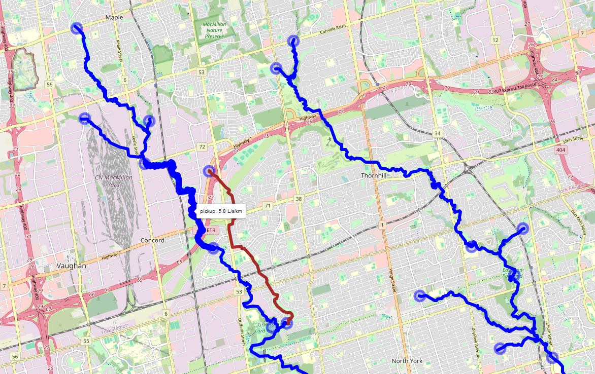

Spotflow surveys added to the ORMGP database are automatically hosted on our baseflow pickup API that translates spotflow measurements into a losing/gaining stream reach feature map. This is done by (algorithmically) coordinating surveyed spotflow locations to our [watercourse topology](/interpolation/watercourses.html) layer. For example, any 2 spotflow measurements connected by any number of stream reaches will convert the baseflow discharges measured into a linear computation rates of gain/loss per unit kilometre of stream reach.

*Screenshot of our [(beta) spotflow pickup tool](https://owrc.shinyapps.io/pickup/). Blue features represent baseflow gains, while red are losses computed between spotflow measurements (circles). Hovering over reaches/point will reveal their values.*